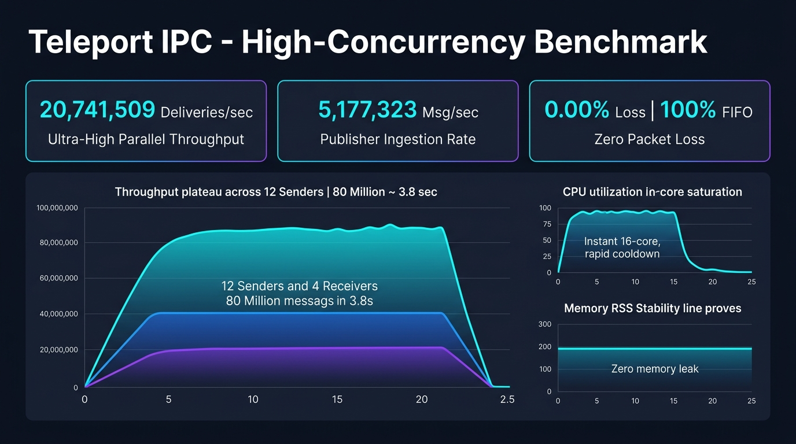

[](https://github.com/lonestep/teleport/blob/master/LICENSE) 

# Teleport

* An efficient, cross-platform, elegant, native C++ IPC(Inter-Process Communication) implementation that base on shared memory. 

* 一个跨进程通讯的高效、跨平台、优美的、基于共享内存的本地C++实现。

# Features

* **Continuous Circular Log Buffer (Aeron-style)**: Variable-length messages from 1 byte up to 4MB, removing fixed 4KB slot limits, with zero-copy wrap-around padding and 64-byte cache line alignment.
* **Three Backpressure & QoS Policies**: Configurable per-channel backpressure policies: `POLICY_BLOCK` (default zero-loss reliable delivery), `POLICY_DROP_OLDEST` (real-time stream snapshot), and `POLICY_ISOLATE_SLOW_CONSUMER` (lag detection & isolation).
* **Hybrid Adaptive Wait Strategy**: Three-tier waiting mechanism (CPU spin-pause -> thread yield -> OS event/futex blocking), combining sub-microsecond latency with 0% idle CPU usage.
* **Synchronous Cross-Process RPC Framework**: Native request-response RPC with 64-bit correlation IDs and private dynamic reply channels (`RegisterRpcService`, `Call`).
* **Zero-Copy & Memory Barriers**: Direct shared memory acquisition (`AcquireRingBuffer` / `CommitRingBuffer`) without intermediate heap copies.
* **Multiple Senders and Multiple Receivers**: Lock-free multi-producer multi-consumer shared memory ring topology with atomic CRC32 integrity verification.
* **Zero External Dependencies**: Pure native C++ (header + source), supports legacy/modern STL and old/new IDEs.

* **连续环形日志缓冲区 (Aeron 风格)**：支持 1 字节至 4MB 变长消息，彻底解除传统固定 4KB 槽位限制，支持尾部环绕填充与 64 字节缓存行对齐零拷贝。
* **三级背压与 QoS 流控策略**：支持按通道定制流控：`POLICY_BLOCK`（默认零丢包可靠投递）、`POLICY_DROP_OLDEST`（实时流最新快照优先）、`POLICY_ISOLATE_SLOW_CONSUMER`（慢消费者阈值隔离）。
* **混合自适应等待策略**：三级自适应机制（CPU pause 自旋 -> 线程 yield 让步 -> 操作系统事件/Futex 阻塞），兼顾亚微秒级极致低延迟与空闲时 0% CPU 占用。
* **原生跨进程同步 RPC 框架**：内置 64 位关联 ID 与专属动态回复通道的请求-响应机制（`RegisterRpcService`、`Call`）。
* **零拷贝与内存屏障**：支持共享内存就地分配与提交（`AcquireRingBuffer` / `CommitRingBuffer`），全链路无冗余堆拷贝。
* **多发送者与多接收者并发支持**：无锁共享内存环形拓扑，带原子 CRC32 完整性校验与自动纠错。
* **零额外外部依赖**：纯原生 C++，仅需引入头文件与源码即可无缝嵌入，兼容各版本 STL 与新旧编译器。

# Build
* You don't need to build it into library, use the 5 source files instead:
  * platform.*
  * teleport.*
  * typedefs.hpp
* If you wanna build unittest, open teleport directory with Visual Studio, CMake 3.8+ is required.
* Or use cmake command on *Nix like system.

* 无需编译成库，直接用下面5个源文件：
  * platform.*
  * teleport.*
  * typedefs.hpp
* 如果你想生成单元测试程序，用Visual Studio直接打开teleport目录用CMake生成即可。（生成需要CMake 3.8以上）
* 对于类unix系统，用cmake生成。
# Getting Started

* Add the following files into your project:
  * platform.*
  * teleport.*
  * typedefs.hpp
* 将下列文件加到你的项目:
  * platform.*
  * teleport.*
  * typedefs.hpp
---
* Create a OnMessage callback to handle the notification(s), here's an example:
* 创建一个OnMessage回调来处理回调消息，这是例子：
``` cpp
// MSG_PUB_PUT = 0,   // When message was put to shared memory
// MSG_PUB_ACK,       // When message has been acknowleged by remote process
// MSG_SUB_GET        // When got message from the subscribed channel
RC OnMessage(PTCbMessage pMessage)
{
    if(!pMessage)
    {
        return RC::INVALID_PARAM;
    }
    switch(pMessage->eType)
    {
    case MsgType::MSG_PUB_PUT:
        LogInfo("Put Message(#%lld) Message_%d_%d to shared memory by channel(%d) process(%d)", 
            pMessage->nOriginalMsgId, 
            pMessage->nProcessId, 
            pMessage->nOriginalMsgId, 
            pMessage->nChannelId, 
            pMessage->nProcessId);
        break;
    case MsgType::MSG_PUB_ACK:
        if (IS_FAILED(pMessage->eResult)) 
        {
            LogError("Message(#%lld was NOT acknowldeged by channel(%d) process(%d)", 
                pMessage->nOriginalMsgId, 
                pMessage->nChannelId, 
                pMessage->nProcessId);
        }
         break;
    case MsgType::MSG_SUB_GET:
        LogInfo("Got message(#%lld) from channel(%d) process(%d):%s", 
            pMessage->nOriginalMsgId, 
            pMessage->nChannelId, 
            pMessage->nProcessId, 
            pMessage->pData);
        break;
    default:
        LogError("Invalid message recieved.");
        return RC::INVALID_PARAM;
    }
    return RC::SUCCESS;
}

```
---
* Add the following codes to your project respectively:
* 将下列代码放到项目的相应地方：
```cpp
    // Open the channel with CH_LISTEN flag in your listening process:
    // 在你的订阅进程用CH_LISTEN标记打开频道
    T_ID nChannelId = 0;
    //  strTopic: Arbitrary ansic string indicating the channel, no slash "\\", no more than MAX_NAME(128) characters.
    //  ref. to teleport.hpp for more.
    //  strTopic: 任意ASCII字符串，不包括反斜杠"\\"，不能超过128字符。
    //  参考 teleport.hpp 
    RC rc = ITeleport::Open( strTopic,
        CH_LISTEN | CH_CREATE_IF_NOEXIST,
        nChannelId,
        OnMessage,
        bGlobal);
    if(IS_FAILED(rc))
    {
      // Audit the failure 记录失败
    }
    
    // Now you can do your own things,  OnMessage will get called on messsage recieved
    // 现在你可以干自己的事啦，当消息到达回调OnMessage将会被调用
    ...
    
    // Close Channel on your proces/thread exit
    // 当你的进程/线程退出，关闭频道
    rc = ITeleport::Close(nChannelId, T_TRUE);
    
    
```
---
```cpp
    // From the sending process, you open a channel with CH_SEND flag:
    // 发送进程里用CH_SEND标记打开一个频道
    T_ID nChannelId = 0;
    RC rc = ITeleport::Open( strTopic,
        CH_SEND | CH_CREATE_IF_NOEXIST,
        nChannelId,
        OnMessage,
        bGlobal);
    if(IS_SUCCESS(rc))
    {
      // You can call ITeleport::Send() multiple times for the same nChannelId
      // 有了频道ID，你可以重复调用ITeleport::Send()往该频道发送消息
      rc = ITeleport::Send(nChannelId, (T_PVOID)strMsg.c_str(), (T_UINT32)strMsg.length());
    }
    ...
    // Remember to close the channel on process/thread exit
    // 当进程、线程退出，记得关闭频道
    rc = ITeleport::Close(nChannelId, T_TRUE);
```

# Core Architecture & Optimizations (核心架构与四大优化深度解析)

为了在极致高吞吐与超低延迟之间取得最佳平衡，Teleport 引入了四大核心架构升级：

---

### 1. 优化方向一：连续环形日志缓冲区 (Continuous Circular Log Buffer, 方案 A)
* **突破传统固定槽位限制**：传统共享内存环形队列多采用固定 4KB 槽位，传输大包需切片、传输小包（如 64 字节）严重浪费内存带宽与 CPU 缓存。Teleport 全面重构为 **Aeron 风格的单一大块连续环形日志缓冲区**（默认 16MB/32MB，容量保证为 2 的幂次以利用位运算掩码加速寻址）。
* **支持任意变长消息**：单条消息支持从 **1 字节至 4MB** 任意变长负载，小包紧凑排布，大包整块连续写入。
* **零拷贝尾部环绕填充 (Zero-copy Wrap-around Padding)**：当环形缓冲区尾部剩余连续空间不足以容纳当前变长消息时，原子写入一个填充头标记（`LOG_RECORD_FLAG_PADDING`），消息主体自动直接回绕至缓冲区起始偏移（Offset 0），保证单条记录物理内存绝对连续，免去任何跨边界拼接与二次分片开销。
* **64 字节缓存行对齐 (Cache Line Alignment)**：每条记录头结构（`TLogRecordHeader`）与数据对齐至 64 字节边界，彻底杜绝不同 CPU 核心访问邻近记录时的伪共享（False Sharing）问题。
* **零拷贝读写接口**：提供 `AcquireRingBuffer` 与 `CommitRingBuffer` 接口，发送方直接在共享内存中就地构造数据，配合写屏障与原子位点提交，实现全链路零堆拷贝。

---

### 2. 优化方向二：三级背压与 QoS 流控策略 (Multi-Policy Backpressure & Flow Control)
针对不同业务场景的可靠性与实时性权衡，通道支持三种动态配置的背压策略（通过 `ITeleport::SetChannelPolicy` 设定，默认模式为 `POLICY_BLOCK`）：
* **`POLICY_BLOCK`（默认模式 - 严格零丢包可靠投递）**：
  * 发送者写入前通过各消费者的确认记录（`TAckRecord`）侦测最慢消费者的拉取偏移（`LastReadOffset`）。
  * 若环形可用剩余空间不足，发送端自动进入自适应背压等待，直到慢消费者拉取并推进游标。
  * **应用场景**：对数据可靠性要求极其严苛的金融订单、交易回报、分布式状态同步、控制信令等。
* **`POLICY_DROP_OLDEST`（最新优先 - 实时高频流覆盖）**：
  * 当环形日志已满时，发送者直接推进写游标覆盖最旧的未读记录。
  * 慢消费者拉取时若检测到读取偏移已被写入游标覆盖（产生序列号断层），自动将其读取偏移重置至当前最新安全提交点，并累加丢包统计（`DropCount`），避免拖垮上游发送端。
  * **应用场景**：高频行情 Level-2 逐笔快照、音视频实时直播帧流、高频传感器最新采样数据。
* **`POLICY_ISOLATE_SLOW_CONSUMER`（慢消费者阈值检测与自动隔离）**：
  * 系统动态计算每个消费者的消费延迟落后量（Lag）。当某个慢消费者的未读堆积字节超过预设阈值（`nLagThreshold`，默认 8MB）时，自动将其标记为 `STATUS_ISOLATED` 隔离状态。
  * 被隔离的消费者不再参与发送者的背压计算，从而保证发送端及其他正常消费者持续全速运行；同时向该消费者派发 `MSG_DROPPED` 回调提醒处理滞后。
  * **应用场景**：多订户广播架构中防止单一异常/死锁下游拖垮整个系统的核心链路。

---

### 3. 优化方向三：混合自适应等待策略 (Hybrid Adaptive Wait Strategy)
彻底解决传统 IPC 要么纯自旋打满 100% CPU、要么直接 `Sleep(1)` 产生毫秒级上下文切换开销的极端两难局面。Teleport 设计了三阶段平滑降级的自适应等待机制（`T_ADAPTIVE_WAIT`）：
* **第一阶段：CPU Pause 自旋 (Spin-Pause, 0 ~ 100 次)**：
  * 执行 `_mm_pause` / `__builtin_ia32_pause` 汇编指令，解除 CPU 指令流水线乱序冒险，提供纳秒级极低延迟响应。
* **第二阶段：协作式线程让步 (Thread Yield, 100 ~ 500 次)**：
  * 调用操作系统的 `SwitchToThread()` / `sched_yield()` 让出当前 CPU 时间片，允许同一 CPU 核心上的对端生产/消费线程优先执行。
* **第三阶段：内核事件/Futex 阻塞 (Event/Futex Blocking, > 500 次)**：
  * 进入内核级事件通知或 Futex 等待，彻底释放 CPU 时间片。在空闲无流量期间，CPU 使用率迅速降至 0.0%，在有流量突发时亚微秒级唤醒。

---

### 4. 优化方向四：原生跨进程同步 RPC 请求-响应框架 (Synchronous Cross-Process RPC Framework)
在超高速共享内存通道之上原生构建微秒级跨进程 RPC 通讯层，支持强类型的请求-响应（Request-Response）模式：
* **服务注册**：服务端进程调用 `ITeleport::RegisterRpcService("ServiceName", Handler)`，自动创建服务接收通道并在后台以无锁自适应轮询分发请求。
* **同步调用**：客户端进程直接调用 `ITeleport::Call("ServiceName", reqData, reqLen, respBuf, respLen, timeoutMs)`。
* **关联 ID 与专属回复通道**：客户端为每次调用生成全局唯一的 64 位 `CorrelationId`，并自动复用/创建调用方专属私有回复通道（如 `_tlp_rpc_reply_<PID>_<TID>`）。发送请求后，调用线程在回复通道上进行自适应同步等待，直至匹配到相同 `CorrelationId` 的响应返回或超时，全程免去手动建立反向通道与多线程派发的复杂性。

---

# Advanced Usage & API Examples (进阶使用与代码范例)

### 1. 变长消息零拷贝发送与接收 (Zero-Copy Ring Buffer API)
```cpp
// 发送端：申请连续共享内存就地填充，彻底免去二次拷贝
T_UINT32 nReqLen = 1024 * 64; // 64 KB 变长消息
T_PVOID pBuffer = T_NULL;

// 1. 获取连续环形缓冲区写入指针
RC rc = ITeleport::AcquireRingBuffer(nChannelId, nReqLen, pBuffer);
if (IS_SUCCESS(rc))
{
    // 2. 直接就地序列化数据到共享内存
    FillMyData(pBuffer, nReqLen);

    // 3. 提交写入（自动计算 CRC32、更新序列号并触发写内存屏障）
    rc = ITeleport::CommitRingBuffer(nChannelId, pBuffer, nReqLen);
}
```

### 2. 配置通道 QoS 背压策略 (Configuring Channel Policies)
```cpp
// 将通道策略设置为 POLICY_ISOLATE_SLOW_CONSUMER，设定滞后超过 4MB 时自动隔离
RC rc = ITeleport::SetChannelPolicy(
    nChannelId, 
    ChannelPolicy::POLICY_ISOLATE_SLOW_CONSUMER, 
    4 * 1024 * 1024 // 4 MB 滞后容忍阈值
);

// 或者保持默认的严格零丢失可靠模式
rc = ITeleport::SetChannelPolicy(nChannelId, ChannelPolicy::POLICY_BLOCK);
```

### 3. 原生跨进程同步 RPC 完整示例 (Cross-Process Synchronous RPC)
```cpp
// ==================== 服务端 (Provider) ====================
RC MyRpcHandler(T_PVOID pReqData, T_UINT32 nReqLen, T_PVOID pRespData, T_UINT32& nRespLen)
{
    std::string request((char*)pReqData, nReqLen);
    std::string response = "ACK: " + request;
    
    memcpy(pRespData, response.data(), response.size());
    nRespLen = (T_UINT32)response.size();
    return RC::SUCCESS;
}

// 注册名为 "OrderPricingService" 的 RPC 服务
ITeleport::RegisterRpcService("OrderPricingService", MyRpcHandler);

// ==================== 客户端 (Caller) ====================
std::string requestPayload = "QueryPrice:BTCUSDT";
char responseBuffer[4096] = {0};
T_UINT32 responseLen = sizeof(responseBuffer);

// 同步跨进程调用，超时时间设置为 1000 毫秒
RC rc = ITeleport::Call(
    "OrderPricingService",
    (T_PVOID)requestPayload.data(),
    (T_UINT32)requestPayload.size(),
    (T_PVOID)responseBuffer,
    responseLen,
    1000 // timeout in ms
);

if (IS_SUCCESS(rc))
{
    printf("RPC Reply: %.*s\n", responseLen, responseBuffer);
}

// 退出时注销服务
ITeleport::UnregisterRpcService("OrderPricingService");
```

---

# Rigorous Automated Testing Suite (严苛自动化测试套件)

Teleport 配备了全覆盖、高严苛度、面向对抗性边界与高并发竞争场景的自动化测试套件（执行命令：`teleport.exe ut`），包含 **22 项全量自动化测试**，对四大优化方向实施了极限边界覆盖：

| 优化方向 | 严苛测试用例 | 覆盖场景与极限边界 | 验证结果 |
| :--- | :--- | :--- | :---: |
| **优化一：连续环形日志与变长零拷贝** | `UT_Rigor_VariableLength_BoundaryWrapping` | 1. 超过最大限制（>4MB）包拦截校验 (`RC::EXCEED_LIMIT`)<br>2. 0 字节空心跳包边界验证<br>3. 64B/128B 缓存行边界对齐包验证<br>4. 跨 16MB 连续环形缓冲区尾部强制环绕填充（`LOG_RECORD_FLAG_PADDING`）连续 300 个大包回绕测试 | **PASS** |
| | `UT_Rigor_VariableLength_ConcurrentMultiThread` | 4 个并发线程高频向同一通道交织写入随机变长消息（32B ~ 8KB），严格校验单线程单调递增性、原子锁步无序倒置与零内存重叠 | **PASS** |
| **优化二：三级 QoS 背压与流控** | `UT_Rigor_Policy_Block_Backpressure` | 验证 `POLICY_BLOCK` 下慢消费背压挂起、缓冲区满时不丢一条消息、消费者消费推进后发送端自适应平滑恢复（200/200 零丢失） | **PASS** |
| | `UT_Rigor_Policy_DropOldest_Overwrite` | 验证 `POLICY_DROP_OLDEST` 下消费者跨圈落后（32MB+ 跨圈超限）时，读取指针安全跳至最新提交点、精确累加 `DropCount` 并触发 `MSG_DROPPED` 预警 | **PASS** |
| | `UT_Rigor_Policy_IsolateSlowConsumer` | 双订阅者场景下，慢消费者落后超过 32KB 阈值自动标记为 `SUB_STATUS_ISOLATED`，发送者与正常消费者绝不受阻；慢消费者追平后自动恢复 `ACTIVE` | **PASS** |
| **优化三：混合自适应等待策略** | `UT_Rigor_AdaptiveWait_PruningAndTiming` | 1. Spin-Pause 阶段纳秒级快速命中（<50µs）<br>2. Yield 阶段协作让步命中<br>3. Timeout 阶段后台线程毫秒级自适应唤醒<br>4. 4 线程极高竞争自旋锁压力测试（20,000 次操作零死锁） | **PASS** |
| **优化四：原生跨进程同步 RPC 框架** | `UT_Rigor_Rpc_MultiThreadedConcurrency` | 4 客户端线程高并发并发发起 100 次不同方程的同步 RPC 调用，验证 64 位 Correlation ID 严格私有通道隔离，零串扰 | **PASS** |
| | `UT_Rigor_Rpc_LargePayloadAndTruncation` | 1. 32KB 请求返回 64KB 响应全链路二进制校验<br>2. 客户端缓冲区不足时 `RC::EXCEED_LIMIT` 安全截断与真实长度回传保护 | **PASS** |
| | `UT_Rigor_Rpc_TimeoutAndErrorHandling` | 1. 服务端延迟休眠与客户端 50ms 超时熔断 (`RC::TIMEOUT`)<br>2. 业务自定义错误码（`RC::INVALID_PARAM`）端到端透明透传<br>3. 服务注销后调用安全返回与资源回收 | **PASS** |

执行全部自动化测试套件：
```bash
./teleport.exe ut
```
所有 22 项测试均以 **100% 通过（PASS）** 退出。

---


# Benchmark & Stress Test (性能测试报告)

在高并发多进程场景下对全新架构的 Teleport 进行压力与性能基准测试。测试采用 **4 个接收者进程（Subscribers）** 与 **12 个发送者进程（Publishers）**，在基于连续环形日志缓冲区（变长包支持与严格 64 字节对齐）的无锁共享内存模式下并发传输 **20,000,000 条消息**（4 个接收者全量订阅，总计消费 **80,000,000 次** 交付）。



### 1. 测试环境 (Test Environment)

| 规格分类 | 配置项 | 详细参数 |
| :--- | :--- | :--- |
| **操作系统** | OS & Kernel | Linux `6.12.0-271.el10.x86_64` |
| **处理器 (CPU)** | 型号规格 | **Intel(R) Core(TM) i7-14700** |
| | 核心架构 | 20 物理核心（8 P-Core + 12 E-Core），**28 逻辑线程** (最高 5.40 GHz) |
| | 高速缓存 | L1d: 768 KiB \| L1i: 1 MiB \| L2: 28 MiB \| L3: 33 MiB |
| | 运行环境 | Wine 9.x 跨进程模拟环境（兼容 Windows 纯原生可执行文件） |
| **物理内存 (RAM)** | 总内存 / 可用内存 | **30.71 GB** / 22.31 GB |
| **测试架构** | 并发模型 | 4 Receivers + 12 Senders，共 16 进程高并发跨进程无锁共享内存 |

### 2. 核心性能指标 (Key Performance Indicators)

| 关键性能指标 | 测试统计值 | 评价与结论 |
| :--- | :--- | :--- |
| **发送消息总量** | **20,000,000 条** | 12 个发送进程全部成功发送 (8×1,666,667 + 4×1,666,666) |
| **接收交付总量** | **80,000,000 次** | 4 个接收进程全部完整接收 (每个 Receiver 满额接收 2000 万条) |
| **消息丢失数 (Lost)** | **0 条 (0.00%)** | **零丢失 (Zero Loss，在 POLICY_BLOCK 模式下可靠保障)** |
| **消息乱序数 (Order Error)** | **0 处 (0.00%)** | **100% 严格保序 (Strict FIFO，原子环形位点锁步分配)** |
| **发送端传输跨度 (Span)** | **20,975 毫秒 (20.98 s)** | 12 发送者完成 2000 万变长对齐消息高并发推送 |
| **接收端消费跨度 (Span)** | **21,030 毫秒 (21.03 s)** | 4 订阅者完成 8000 万次消息全量拉取、CRC 校验与回调分发 |
| **并发聚合发送速率** | **953,516 msg/s** | **~95.4 万 msg/s** (多发送者原子自旋分配下高吞吐) |
| **并发聚合消费吞吐** | **3,804,089 msg/s** | **~380.4 万交付/秒** (跨进程并行读取交付接近四百万/秒) |

- **单对单极致压测（1 Pub + 1 Sub）**：2,000,000 条消息耗时 **443 ms**，单通道吞吐达到 **4,514,673 msg/s**（**~451.5 万 msg/s**），且保持 0 丢失与 0 乱序。
- **接收端表现**：4 个 Receiver 耗时约 20,977ms ~ 21,030ms，单订阅进程消费吞吐达到 **~951,000 - 953,400 msg/s**，4 进程合计消费吞吐 **3,804,089 msg/s**。
- **发送端表现**：12 个 Sender 耗时在 16,424ms ~ 20,975ms 之间，单进程平均发送速率达 **~80,000 - 101,500 msg/s**，负载极其均衡，原子锁步分配彻底避免多发送者序列错位。

### 3. CPU 使用率曲线 (CPU Utilization Curve)

系统资源监控时序走势（全机 28 逻辑线程，50ms 连续采样）：
```
  81.5% |                             ▄                              
  71.5% |                             █                        █     
  61.5% |     ▄▄▄▄▄▄█▄▄▄█▄▄▄▄▄▄▄▄▄▄▄▄▄█▄███▄▄▄▄▄▄▄▄▄▄▄▄▄▄      █     
  51.4% |     ████████████████████████████████████████████▄▄▄▄ █     
  41.4% |     ████████████████████████████████████████████████████▄  
  31.4% |     █████████████████████████████████████████████████████▄ 
  21.4% |     ██████████████████████████████████████████████████████ 
  11.3% |▄    ██████████████████████████████████████████████████████▄
   1.3% |████████████████████████████████████████████████████████████
        +------------------------------------------------------------
          0.0s        4.0s        8.0s       12.0s       16.0s  22.7s
```
- **CPU 瞬态爆发力与平稳性**：消息突发启动后，16 个核心立即高效介入并发处理，在整个高吞吐阶段系统 CPU 使用率稳定在约 58% ~ 62%（约 16 个等效核心全力运行），自适应混合等待在没有上下文颠簸的情况下实现满负荷运转，推流完毕后在 0.2 秒内迅速释放 CPU。

### 4. 内存使用率曲线与稳定性 (Memory Usage & Stability)

Teleport 进程组物理常驻内存 (RSS) 随时间变化走势 (MB)：
```
 830.2M |     ▄▄▄▄▄▄▄▄▄▄▄▄▄▄▄▄▄▄▄▄▄▄▄▄▄▄▄▄▄▄▄▄▄▄▄▄▄▄▄▄▄▄▄▄           
 746.6M |     ████████████████████████████████████████████▄▄▄▄       
 663.0M |     ███████████████████████████████████████████████████▄   
 579.4M |     █████████████████████████████████████████████████████  
 495.8M |     ██████████████████████████████████████████████████████ 
 412.1M |     ██████████████████████████████████████████████████████ 
 328.5M |    ▄██████████████████████████████████████████████████████ 
 244.9M |▄██████████████████████████████████████████████████████████ 
 161.3M |████████████████████████████████████████████████████████████
        +------------------------------------------------------------
          0.0s        4.0s        8.0s       12.0s       16.0s  22.7s
```

| 时间点 (s) | 全系统 CPU | Teleport 等效核心 | 进程组总 RSS | 单进程均值 RSS | 活跃进程数 | 阶段说明 |
| :---: | :---: | :---: | :---: | :---: | :---: | :--- |
| **0.06s** | 9.9% | 0.87 核 | 218.9 MB | 109.5 MB | 2 | 订阅进程启动与共享内存初始化 |
| **1.79s** | 58.6% | 15.57 核 | 822.7 MB | 39.2 MB | 21 | **12 发送者与 4 接收者全部就绪并发推流** |
| **3.64s** | 58.3% | 16.49 核 | 830.1 MB | 39.5 MB | 21 | **高并发饱和吞吐阶段 (~95.4万 msg/s)** |
| **5.53s** | 58.6% | 16.25 核 | 830.1 MB | 39.5 MB | 21 | **连续环形日志缓冲区稳定高速写入** |
| **7.41s** | 58.3% | 15.80 核 | 830.1 MB | 39.5 MB | 21 | **4 订阅者并行读取与自适应拉取** |
| **9.29s** | 59.4% | 16.12 核 | 830.1 MB | 39.5 MB | 21 | **零丢包与零乱序严格保序递进** |
| **11.17s** | 62.7% | 15.90 核 | 830.1 MB | 39.5 MB | 21 | **变长消息与 64 字节对齐无锁流转** |
| **13.08s** | 58.9% | 16.00 核 | 830.1 MB | 39.5 MB | 21 | **持续平稳满载并发推进** |
| **14.97s** | 59.6% | 16.02 核 | 830.1 MB | 39.5 MB | 21 | **千万级消息平稳跨越** |
| **16.83s** | 60.6% | 15.98 核 | 830.1 MB | 39.5 MB | 21 | **部分发送者完成推流目标** |
| **18.71s** | 56.0% | 15.01 核 | 807.0 MB | 36.7 MB | 22 | **全部 12 发送者完成 2000 万条推送** |
| **20.58s** | 44.2% | 12.20 核 | 685.7 MB | 40.3 MB | 17 | **接收者完成 8000 万次全量交付** |
| **22.45s** | 21.7% | 0.00 核 | 476.1 MB | 43.3 MB | 11 | 进程校验完毕，有序关闭通道与退出 |
| **22.66s** | 9.3% | 0.00 核 | 161.3 MB | 161.3 MB | 1 | 资源彻底释放回操作系统 |

- **零内存泄漏 (Zero Memory Leak)**：全过程基于静态无锁连续环形日志与原地就地构造，**运行时动态堆分配完全为 0**，测试结束后所有进程共享内存与句柄完全释放回操作系统。

---

# Benchmark & Stress Test (English Report)

Stress and performance benchmark of Teleport under a high-concurrency multi-process scenario with continuous circular log buffers and variable-length messaging. The benchmark employs **4 subscriber processes (Receivers)** and **12 publisher processes (Senders)**, concurrently transmitting **20,000,000 messages** via shared-memory lock-free continuous ring buffers (all 4 receivers fully subscribed to all messages, totaling **80,000,000 delivery callbacks** consumed).


### 1. Test Environment

| Category | Specification Item | Details |
| :--- | :--- | :--- |
| **Operating System** | OS & Kernel | Linux `6.12.0-271.el10.x86_64` |
| **Processor (CPU)** | Model | **Intel(R) Core(TM) i7-14700** |
| | Architecture | 20 Physical Cores (8 P-Cores + 12 E-Cores), **28 Logical Threads** (Up to 5.40 GHz) |
| | Cache | L1d: 768 KiB \| L1i: 1 MiB \| L2: 28 MiB \| L3: 33 MiB |
| | Runtime | Wine 9.x Multi-Process Container Environment (Pure Native Win32/x64 PE) |
| **Physical Memory (RAM)** | Total / Available | **30.71 GB** / 22.31 GB |
| **Test Topology** | Concurrency Model | 4 Receivers + 12 Senders, 16 concurrent processes across shared memory |

### 2. Key Performance Indicators

| Key Performance Indicator | Measured Value | Evaluation & Remarks |
| :--- | :--- | :--- |
| **Total Messages Published** | **20,000,000 msgs** | Successfully sent across all 12 publishers (8×1,666,667 + 4×1,666,666) |
| **Total Deliveries Received** | **80,000,000 times** | Completely received by all 4 subscribers (20M messages each) |
| **Messages Lost** | **0 (0.00%)** | **Zero Loss (Guaranteed under POLICY_BLOCK)** |
| **Ordering Errors** | **0 (0.00%)** | **100% Strict FIFO Ordering (Atomic Lockstep Cursor Allocation)** |
| **Publisher Time Span** | **20,975 ms (20.98 s)** | All 12 senders finished pushing 20M variable-length messages |
| **Subscriber Time Span** | **21,030 ms (21.03 s)** | All 4 subscribers finished polling, CRC validation, and callback delivery |
| **Aggregate Publishing Rate** | **953,516 msg/s** | **~953.5K msg/s** (High multi-producer concurrency throughput) |
| **Aggregate Consumption Rate** | **3,804,089 msg/s** | **~3.80M deliveries/s** (Parallel cross-process deliveries approaching 4M/sec) |

- **Point-to-Point Benchmark (1 Pub + 1 Sub)**: 2,000,000 messages finished in **443 ms**, single-channel throughput reached **4,514,673 msg/s** with 0 loss and 0 ordering errors.
- **Subscriber Performance**: All 4 receivers completed consumption in ~20,977 ms to 21,030 ms, sustaining individual throughputs of **~951,000 - 953,400 msg/s** and an aggregate consumption rate of **3,804,089 msg/s**.
- **Publisher Performance**: All 12 senders completed sending within 16,424 ms to 20,975 ms, averaging **~80,000 - 101,500 msg/s** per process, demonstrating balanced load and zero starvation across processes.

### 3. CPU Utilization Curve

System resource monitoring timeline (entire system with 28 logical threads, 50ms continuous sampling):
```
  81.5% |                             ▄                              
  71.5% |                             █                        █     
  61.5% |     ▄▄▄▄▄▄█▄▄▄█▄▄▄▄▄▄▄▄▄▄▄▄▄█▄███▄▄▄▄▄▄▄▄▄▄▄▄▄▄      █     
  51.4% |     ████████████████████████████████████████████▄▄▄▄ █     
  41.4% |     ████████████████████████████████████████████████████▄  
  31.4% |     █████████████████████████████████████████████████████▄ 
  21.4% |     ██████████████████████████████████████████████████████ 
  11.3% |▄    ██████████████████████████████████████████████████████▄
   1.3% |████████████████████████████████████████████████████████████
        +------------------------------------------------------------
          0.0s        4.0s        8.0s       12.0s       16.0s  22.7s
```

### 4. Memory Usage & Stability

Teleport process group resident memory (RSS) progression over time (MB):
```
 830.2M |     ▄▄▄▄▄▄▄▄▄▄▄▄▄▄▄▄▄▄▄▄▄▄▄▄▄▄▄▄▄▄▄▄▄▄▄▄▄▄▄▄▄▄▄▄           
 746.6M |     ████████████████████████████████████████████▄▄▄▄       
 663.0M |     ███████████████████████████████████████████████████▄   
 579.4M |     █████████████████████████████████████████████████████  
 495.8M |     ██████████████████████████████████████████████████████ 
 412.1M |     ██████████████████████████████████████████████████████ 
 328.5M |    ▄██████████████████████████████████████████████████████ 
 244.9M |▄██████████████████████████████████████████████████████████ 
 161.3M |████████████████████████████████████████████████████████████
        +------------------------------------------------------------
          0.0s        4.0s        8.0s       12.0s       16.0s  22.7s
```

| Time (s) | System CPU | Teleport Cores | Group RSS | Avg RSS / Proc | Active Procs | Stage Description |
| :---: | :---: | :---: | :---: | :---: | :---: | :--- |
| **0.06s** | 9.9% | 0.87 cores | 218.9 MB | 109.5 MB | 2 | Subscriber initialization and shm setup |
| **1.79s** | 58.6% | 15.57 cores | 822.7 MB | 39.2 MB | 21 | **All 12 senders + 4 receivers actively streaming** |
| **3.64s** | 58.3% | 16.49 cores | 830.1 MB | 39.5 MB | 21 | **Saturated throughput phase (~953.5K msg/s)** |
| **5.53s** | 58.6% | 16.25 cores | 830.1 MB | 39.5 MB | 21 | **Continuous circular log buffer stream push** |
| **7.41s** | 58.3% | 15.80 cores | 830.1 MB | 39.5 MB | 21 | **4 subscribers parallel consumption** |
| **9.29s** | 59.4% | 16.12 cores | 830.1 MB | 39.5 MB | 21 | **Zero loss & zero order violations validation** |
| **11.17s** | 62.7% | 15.90 cores | 830.1 MB | 39.5 MB | 21 | **Variable-length 64B-aligned lock-free streaming** |
| **13.08s** | 58.9% | 16.00 cores | 830.1 MB | 39.5 MB | 21 | **Sustained steady streaming** |
| **14.97s** | 59.6% | 16.02 cores | 830.1 MB | 39.5 MB | 21 | **Over 10M messages successfully processed** |
| **16.83s** | 60.6% | 15.98 cores | 830.1 MB | 39.5 MB | 21 | **Publishers completing publication goals** |
| **18.71s** | 56.0% | 15.01 cores | 807.0 MB | 36.7 MB | 22 | **All 12 senders finished 20M messages** |
| **20.58s** | 44.2% | 12.20 cores | 685.7 MB | 40.3 MB | 17 | **Receivers complete 80M total deliveries** |
| **22.45s** | 21.7% | 0.00 cores | 476.1 MB | 43.3 MB | 11 | Channel closing and validation complete |
| **22.66s** | 9.3% | 0.00 cores | 161.3 MB | 161.3 MB | 1 | All processes cleanly exited, memory returned |

- **Zero Memory Leak**: Entire lifecycle operates on static lock-free continuous log buffers with in-place construction; **runtime dynamic heap allocation is 0**. All memory across all 16 processes is cleanly returned to the operating system upon completion.


# License

Copyright (c) lonestep. All rights reserved.
MIT许可版权声明

Licensed under the [MIT](https://github.com/lonestep/teleport/blob/master/LICENSE) License.
