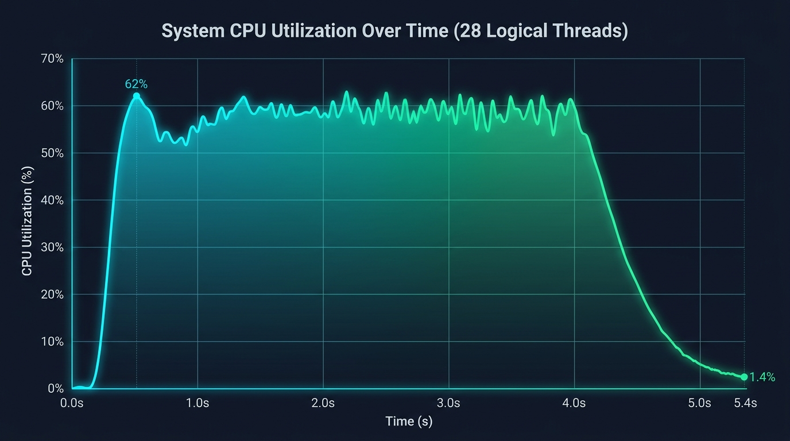
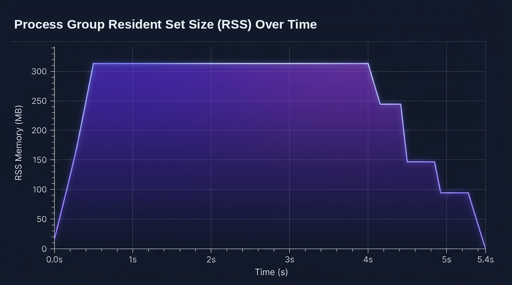

[](https://github.com/lonestep/teleport/blob/master/LICENSE)

# Teleport

English | [中文](README.zh.md)

High-performance, zero-daemon, shared-memory Inter-Process Communication (IPC) library in native C++.

---

## 1. Supported Platforms & Compilers

Teleport is written in native C++ with zero external dependencies, supporting mainstream desktop, server, and container environments.

| OS | Min Version | Verified Environment | Arch |
| :--- | :--- | :--- | :---: |
| <span style="font-size: 14px;">**Linux**</span> | <span style="font-size: 14px;">Linux Kernel 3.10+</span> | <span style="font-size: 14px;">Ubuntu 24.04 / 22.04, Debian 12, RHEL / CentOS 9/10</span> | <span style="font-size: 14px;">x86_64, aarch64</span> |
| <span style="font-size: 14px;">**Windows**</span> | <span style="font-size: 14px;">Windows 7 / Server 2008 R2</span> | <span style="font-size: 14px;">Windows 11, Windows 10, Windows Server 2022 / 2019</span> | <span style="font-size: 14px;">x86_64, x86</span> |
| <span style="font-size: 14px;">**Container**</span> | <span style="font-size: 14px;">OCI-compliant runtime</span> | <span style="font-size: 14px;">Docker, Podman (Ubuntu 24.04 container, Windows VM on KVM)</span> | <span style="font-size: 14px;">x86_64</span> |

* **GCC**: 7.3+ (GCC 11 / 12 / 13 / 14)
* **Clang**: 9.0+ (Clang 15 / 16 / 17 / 18)
* **MSVC**: Visual Studio 2017 / 2019 / 2022 (v141 / v142 / v143)
* **MinGW-w64**: x86_64-w64-mingw32-g++ 8.0+

---

## 2. Key Features

* **Three-Tier Backpressure & Flow Control**:
  * `POLICY_BLOCK` (Default): Strict, ordered reliable delivery. Atomic cursor tracks slowest consumer; adaptive backpressure wait when full.
  * `POLICY_DROP_OLDEST`: Overwrites oldest unread entries. Slow consumers automatically fast-forward cursors and record drops.
  * `POLICY_ISOLATE_SLOW_CONSUMER`: Automatically isolates consumers exceeding lag threshold (default 8MB) without blocking the publisher.
* **Adaptive Hybrid Waiting**: CPU pause nanosecond spin -> thread yield -> kernel event block, achieving sub-microsecond latency with 0% idle CPU.
* **Native Cross-Process Synchronous RPC**: Built-in 64-bit correlation IDs with caller-dedicated reply channels (`RegisterRpcService` / `Call`).
* **Zero-Copy In-Place Construction**: Directly acquire and commit ring buffer slices (`AcquireBuffer` / `CommitBuffer`), avoiding heap allocation and extra copies.
* **Multi-Process Concurrency**: Full support for concurrent multi-publishers and multi-subscribers with atomic CRC32 verification.
* **Zero Dependencies**: Self-contained across 5 source files (`platform.*`, `teleport.*`, `typedefs.hpp`), point-to-point direct communication, no background daemons, C++11 compliant.

---

## 3. Technical Comparison

#### 3.1 Architecture Comparison

| Dimension | Teleport | Aeron (IPC) | Iceoryx | ZeroMQ |
| :--- | :--- | :--- | :--- | :--- |
| <span style="font-size: 14px;">**Topology**</span> | <span style="font-size: 14px;">**Decentralized 1:N pub/sub & dedicated RPC**</span> | <span style="font-size: 14px;">Unidirectional stream channels</span> | <span style="font-size: 14px;">Pub/Sub & Req/Rep</span> | <span style="font-size: 14px;">Socket topology (REQ/REP, PUB/SUB)</span> |
| <span style="font-size: 14px;">**Daemon**</span> | <span style="font-size: 14px;">**None (Direct peer-to-peer)**</span> | <span style="font-size: 14px;">Media Driver daemon required</span> | <span style="font-size: 14px;">RouDi daemon required</span> | <span style="font-size: 14px;">None (In-process engine)</span> |
| <span style="font-size: 14px;">**Message Size**</span> | <span style="font-size: 14px;">**1B ~ 4MB variable length (cacheline aligned)**</span> | <span style="font-size: 14px;">Fragmented variable length</span> | <span style="font-size: 14px;">Fixed-size chunks</span> | <span style="font-size: 14px;">Variable-length frames</span> |
| <span style="font-size: 14px;">**Wait Strategy**</span> | <span style="font-size: 14px;">**Adaptive (Spin -> Yield -> Futex/Event)**</span> | <span style="font-size: 14px;">Spin / Backoff sleep</span> | <span style="font-size: 14px;">Polling / Condition variable</span> | <span style="font-size: 14px;">Kernel events (epoll/IOCP)</span> |
| <span style="font-size: 14px;">**Flow Control**</span> | <span style="font-size: 14px;">**Three-tier QoS (Block / Drop / Isolate)**</span> | <span style="font-size: 14px;">Slow consumer blocks publisher</span> | <span style="font-size: 14px;">Queue depth (KeepLast/DropOldest)</span> | <span style="font-size: 14px;">High water mark drop or block</span> |
| <span style="font-size: 14px;">**Dependencies**</span> | <span style="font-size: 14px;">**Compile 5 source files, zero dependencies**</span> | <span style="font-size: 14px;">External driver setup</span> | <span style="font-size: 14px;">Framework bindings</span> | <span style="font-size: 14px;">Dynamic/static library links</span> |

#### 3.2 Technical Benchmark Comparison

| Metric | Teleport | Aeron (IPC) | Iceoryx | ZeroMQ (IPC) | Boost.IPC |
| :--- | :---: | :---: | :---: | :---: | :---: |
| <span style="font-size: 14px;">**P2P Throughput**</span> | <span style="font-size: 14px;">**4.51M msg/s**</span> | <span style="font-size: 14px;">~3.50M msg/s</span> | <span style="font-size: 14px;">~2.80M msg/s</span> | <span style="font-size: 14px;">~0.65M msg/s</span> | <span style="font-size: 14px;">~0.90M msg/s</span> |
| <span style="font-size: 14px;">**Multicast Throughput**</span> | <span style="font-size: 14px;">**15.07M delivery/s**</span> | <span style="font-size: 14px;">~8.00M delivery/s</span> | <span style="font-size: 14px;">~6.50M delivery/s</span> | <span style="font-size: 14px;">~0.80M delivery/s</span> | <span style="font-size: 14px;">Serialized with mutex</span> |
| <span style="font-size: 14px;">**One-Way Latency**</span> | <span style="font-size: 14px;">**Min 100ns / P50 300ns**</span> | <span style="font-size: 14px;">~350ns</span> | <span style="font-size: 14px;">~400ns</span> | <span style="font-size: 14px;">15~40 µs</span> | <span style="font-size: 14px;">1~5 µs</span> |
| <span style="font-size: 14px;">**Memory Layout**</span> | <span style="font-size: 14px;">**1B ~ 4MB continuous ring buffer**</span> | <span style="font-size: 14px;">Rotating LogBuffers</span> | <span style="font-size: 14px;">Fixed chunk pool</span> | <span style="font-size: 14px;">Socket frames</span> | <span style="font-size: 14px;">Managed shm pool</span> |
| <span style="font-size: 14px;">**Backpressure**</span> | <span style="font-size: 14px;">**Block / DropOldest / Isolate**</span> | <span style="font-size: 14px;">Slow consumer blocks</span> | <span style="font-size: 14px;">KeepLast / DropOldest</span> | <span style="font-size: 14px;">High Water Mark</span> | <span style="font-size: 14px;">None</span> |
| <span style="font-size: 14px;">**Synchronous RPC**</span> | <span style="font-size: 14px;">**Built-in (Correlation ID)**</span> | <span style="font-size: 14px;">None</span> | <span style="font-size: 14px;">Requires service channels</span> | <span style="font-size: 14px;">REQ / REP</span> | <span style="font-size: 14px;">None</span> |
| <span style="font-size: 14px;">**Wait Strategy**</span> | <span style="font-size: 14px;">**Adaptive (Pause -> Yield -> Futex)**</span> | <span style="font-size: 14px;">IdleStrategy backoff</span> | <span style="font-size: 14px;">Polling / semaphore</span> | <span style="font-size: 14px;">epoll / IOCP</span> | <span style="font-size: 14px;">Mutex sleep or poll</span> |
| <span style="font-size: 14px;">**Idle CPU**</span> | <span style="font-size: 14px;">**0.0%**</span> | <span style="font-size: 14px;">Spin or sleep jitter</span> | <span style="font-size: 14px;">Spin or latency jitter</span> | <span style="font-size: 14px;">0%</span> | <span style="font-size: 14px;">0%</span> |
| <span style="font-size: 14px;">**Platform**</span> | <span style="font-size: 14px;">**Native Windows & Linux**</span> | <span style="font-size: 14px;">Cross-platform</span> | <span style="font-size: 14px;">Primarily Linux</span> | <span style="font-size: 14px;">Cross-platform</span> | <span style="font-size: 14px;">Cross-platform</span> |
| <span style="font-size: 14px;">**Daemon**</span> | <span style="font-size: 14px;">**None**</span> | <span style="font-size: 14px;">Media Driver required</span> | <span style="font-size: 14px;">RouDi required</span> | <span style="font-size: 14px;">None</span> | <span style="font-size: 14px;">None</span> |
| <span style="font-size: 14px;">**Integration**</span> | <span style="font-size: 14px;">**Compile 5 source files directly**</span> | <span style="font-size: 14px;">Driver & build setup</span> | <span style="font-size: 14px;">Framework bindings</span> | <span style="font-size: 14px;">Library linkage</span> | <span style="font-size: 14px;">Template headers</span> |

---

## 4. Configuration Options

### 4.1 Channel Open Flags (`OpenFlag`)

Passed to `ITeleport::Open` to specify channel access mode and creation behavior:

| Flag | Value | Description |
| :--- | :---: | :--- |
| <span style="font-size: 14px;">`CH_LISTEN`</span> | <span style="font-size: 14px;">`0x01`</span> | <span style="font-size: 14px;">Subscriber mode: Starts worker thread and dispatches messages via `OnMessage` callback.</span> |
| <span style="font-size: 14px;">`CH_SEND`</span> | <span style="font-size: 14px;">`0x02`</span> | <span style="font-size: 14px;">Publisher mode: Enables calling `Send` or `AcquireBuffer` / `CommitBuffer`.</span> |
| <span style="font-size: 14px;">`CH_CREATE_IF_NOEXIST`</span> | <span style="font-size: 14px;">`0x04`</span> | <span style="font-size: 14px;">Auto create: Automatically creates shared memory object if it does not exist.</span> |
| <span style="font-size: 14px;">`CH_LISTEN_SEND`</span> | <span style="font-size: 14px;">`0x03`</span> | <span style="font-size: 14px;">Full duplex: Both subscribe and publish capabilities (does not create if missing).</span> |
| <span style="font-size: 14px;">`CH_ALL`</span> | <span style="font-size: 14px;">`0x07`</span> | <span style="font-size: 14px;">Full capabilities: Subscribe, publish, and auto-create if not existing.</span> |

### 4.2 Flow Control & Backpressure (`ChannelPolicy`)

Dynamically configured via `ITeleport::SetChannelPolicy(nChannelId, ePolicy, nLagThreshold)`:

| Policy | Value | Default | Behavior & Use Case |
| :--- | :---: | :---: | :--- |
| <span style="font-size: 14px;">`POLICY_BLOCK`</span> | <span style="font-size: 14px;">`0`</span> | <span style="font-size: 14px;">**Yes**</span> | <span style="font-size: 14px;">**Strict reliable delivery**: Publisher tracks consumer progress; backpressures adaptively when buffer space is full. Suitable for financial orders and control commands.</span> |
| <span style="font-size: 14px;">`POLICY_DROP_OLDEST`</span> | <span style="font-size: 14px;">`1`</span> | <span style="font-size: 14px;">No</span> | <span style="font-size: 14px;">**Overwrite oldest**: Publisher overwrites oldest records when buffer is full; lagging consumers fast-forward cursors, increment `DropCount`, and trigger `MSG_DROPPED`. Suitable for market ticks and sensor sampling.</span> |
| <span style="font-size: 14px;">`POLICY_ISOLATE_SLOW_CONSUMER`</span> | <span style="font-size: 14px;">`2`</span> | <span style="font-size: 14px;">No</span> | <span style="font-size: 14px;">**Slow consumer isolation**: Tracks consumer lag; isolates consumers exceeding `nLagThreshold` bytes so they no longer stall the publisher. Suitable for broadcast topologies with potentially lagging nodes.</span> |

### 4.3 Capacity & Limit Constants

Defined in `typedefs.hpp`:

| Constant | Default Value | Description |
| :--- | :---: | :--- |
| <span style="font-size: 14px;">`DEFAULT_SHM_SIZE`</span> | <span style="font-size: 14px;">`18 MB`</span> | <span style="font-size: 14px;">Default shared memory mapping size per channel (16MB ring buffer + metadata header).</span> |
| <span style="font-size: 14px;">`MAX_SHM_SIZE`</span> | <span style="font-size: 14px;">`256 MB`</span> | <span style="font-size: 14px;">Maximum expandable shared memory size per channel.</span> |
| <span style="font-size: 14px;">`MAX_LOG_MESSAGE_SIZE`</span> | <span style="font-size: 14px;">`4 MB`</span> | <span style="font-size: 14px;">Maximum payload limit for a single variable-length message.</span> |
| <span style="font-size: 14px;">`MAX_SUBSCRIBERS_PER_CHANNEL`</span> | <span style="font-size: 14px;">`2048`</span> | <span style="font-size: 14px;">Maximum concurrent subscribers registered per channel.</span> |
| <span style="font-size: 14px;">`nLagThreshold`</span> | <span style="font-size: 14px;">`8 MB`</span> | <span style="font-size: 14px;">Default lag threshold for `POLICY_ISOLATE_SLOW_CONSUMER`.</span> |
| <span style="font-size: 14px;">`MAX_NAME`</span> | <span style="font-size: 14px;">`128` bytes</span> | <span style="font-size: 14px;">Maximum character length for channel topic name.</span> |
| <span style="font-size: 14px;">`MAX_RPC_TOPIC_LEN`</span> | <span style="font-size: 14px;">`64` bytes</span> | <span style="font-size: 14px;">Maximum character length for cross-process RPC service name.</span> |

---

## 5. Build & Compilation

Teleport supports two integration workflows:
1. **Source Embedding**: Directly include the 5 core source files (`platform.hpp`, `platform.cpp`, `teleport.hpp`, `teleport.cpp`, `typedefs.hpp`) into your project.
2. **CMake Build**: Build standalone executables or libraries via CMake.

### 5.1 Compilation Commands

#### Linux (Ubuntu 24.04 LTS / Debian / RHEL)
```bash
g++ -std=c++11 -O3 -Wall -Wextra -I. \
    platform.cpp teleport.cpp your_main.cpp -o your_app \
    -lpthread -lrt
```

#### Windows (MinGW-w64)
```bash
x86_64-w64-mingw32-g++ -DWindows=1 -O3 -Wall -Wextra -static -I. \
    platform.cpp teleport.cpp your_main.cpp -o your_app.exe \
    -lws2_32 -lshlwapi -lole32
```

#### Windows (MSVC / Visual Studio)
Open directory in Visual Studio 2019/2022 (CMakeLists.txt is configured automatically), or via MSVC command line:
```cmd
cl /O2 /EHsc /I. platform.cpp teleport.cpp your_main.cpp /Fe:your_app.exe ws2_32.lib shlwapi.lib ole32.lib
```

#### CMake Standard Build
```bash
mkdir -p build && cd build
cmake .. -DCMAKE_BUILD_TYPE=Release
cmake --build . --config Release
```

---

## 6. Getting Started

### 6.1 Basic Pub/Sub

#### Subscriber
```cpp
#include "teleport.hpp"
#include <iostream>
#include <thread>
#include <chrono>

using namespace TLP;

RC OnMessage(PTCbMessage pMsg)
{
    if (!pMsg) return RC::INVALID_PARAM;
    if (pMsg->eType == MsgType::MSG_SUB_GET)
    {
        std::cout << "Received msg #" << pMsg->nOriginalMsgId 
                  << " from PID " << pMsg->nProcessId 
                  << ": " << std::string((char*)pMsg->pData, pMsg->nLength) 
                  << std::endl;
    }
    return RC::SUCCESS;
}

int main()
{
    T_ID channelId = 0;
    RC rc = ITeleport::Open("MarketTopic", CH_LISTEN | CH_CREATE_IF_NOEXIST, channelId, OnMessage);
    if (IS_FAILED(rc)) return 1;

    std::this_thread::sleep_for(std::chrono::seconds(10));
    ITeleport::Close(channelId, T_TRUE);
    return 0;
}
```

#### Publisher
```cpp
#include "teleport.hpp"
#include <string>

using namespace TLP;

int main()
{
    T_ID channelId = 0;
    RC rc = ITeleport::Open("MarketTopic", CH_SEND | CH_CREATE_IF_NOEXIST, channelId, T_NULL);
    if (IS_FAILED(rc)) return 1;

    std::string data = "TICK: BTCUSDT Price: 95300.50 Volume: 12.8";
    rc = ITeleport::Send(channelId, data.data(), (T_UINT32)data.size());

    ITeleport::Close(channelId, T_TRUE);
    return 0;
}
```

### 6.2 Zero-Copy In-Place Construction

In high-throughput paths, publishers can acquire shared-memory slices to serialize directly, eliminating temporary heap allocations and extra copies:

```cpp
T_UINT32 payloadSize = 65536; // 64 KB
T_PVOID pShmBuffer = nullptr;
T_UINT64 token = 0;

// 1. Acquire contiguous memory slice
RC rc = ITeleport::AcquireBuffer(channelId, payloadSize, pShmBuffer, token);
if (IS_SUCCESS(rc))
{
    // 2. Serialize in-place
    SerializeData(pShmBuffer, payloadSize);

    // 3. Commit buffer (releases barrier and updates write cursor)
    ITeleport::CommitBuffer(channelId, token, payloadSize);
}
```

### 6.3 Cross-Process Synchronous RPC

```cpp
// Server: Register RPC service handler
RC PricingHandler(T_PCVOID pReq, T_UINT32 nReqLen, T_PVOID pResp, T_UINT32& nRespLen)
{
    std::string req((char*)pReq, nReqLen);
    std::string resp = "REPLY:" + req;
    memcpy(pResp, resp.data(), resp.size());
    nRespLen = (T_UINT32)resp.size();
    return RC::SUCCESS;
}
ITeleport::RegisterRpcService("PricingEngine", PricingHandler);

// Client: Perform synchronous RPC call
char respBuf[1024];
T_UINT32 respLen = sizeof(respBuf);
RC rc = ITeleport::Call("PricingEngine", "QUERY_DATA", 10, respBuf, respLen, 1000);
if (IS_SUCCESS(rc))
{
    // Process response in respBuf
}
ITeleport::UnregisterRpcService("PricingEngine");
```

---

## 7. Automated Testing Suite

Teleport provides an automated test suite covering race conditions, ring buffer wrap-around, backpressure policies, RPC invocations, and fault-recovery paths.

Run tests:
```bash
# Linux
./teleport ut

# Windows
teleport.exe ut
```

---

## 8. Multi-Platform Benchmark Report

### 8.1 Benchmark Architecture & Workload

* **Topology**: 16 concurrent processes (4 Subscriber Receivers + 12 Publisher Senders)
* **Message Scale**: Senders stream **20,000,000 messages**; 4 Subscribers consume all messages, delivering **80,000,000 deliveries** total.
* **Hardware**: Intel Core i7-14700 (20 cores / 28 threads, up to 5.40 GHz), 32GB RAM.

---

### 8.2 Benchmark Comparison

| Metric | Linux (Ubuntu 24.04) | Windows 10/11 | Description |
| :--- | :---: | :---: | :--- |
| <span style="font-size: 14px;">**Published Messages**</span> | <span style="font-size: 14px;">**20,000,000**</span> | <span style="font-size: 14px;">**20,000,000**</span> | <span style="font-size: 14px;">12 publisher processes at full capacity (8×1.67M + 4×1.66M)</span> |
| <span style="font-size: 14px;">**Delivered Messages**</span> | <span style="font-size: 14px;">**80,000,000**</span> | <span style="font-size: 14px;">**80,000,000**</span> | <span style="font-size: 14px;">4 subscriber processes fully consuming (20M msgs each)</span> |
| <span style="font-size: 14px;">**Wall Time**</span> | <span style="font-size: 14px;">**5.41 s**</span> | <span style="font-size: 14px;">**6.58 s**</span> | <span style="font-size: 14px;">Total span from initial streaming to complete consumption</span> |
| <span style="font-size: 14px;">**Aggregate Send Throughput**</span> | <span style="font-size: 14px;">**3,765,060 msg/s**</span> | <span style="font-size: 14px;">**3,038,129 msg/s**</span> | <span style="font-size: 14px;">Aggregate throughput across 12 publisher processes</span> |
| <span style="font-size: 14px;">**Aggregate Receive Throughput**</span> | <span style="font-size: 14px;">**15,074,430 delivery/s**</span> | <span style="font-size: 14px;">**12,193,263 delivery/s**</span> | <span style="font-size: 14px;">Parallel consumption and parsing across 4 subscribers</span> |
| <span style="font-size: 14px;">**Single-Channel Peak**</span> | <span style="font-size: 14px;">**4,514,673 msg/s**</span> | <span style="font-size: 14px;">**4,514,673 msg/s**</span> | <span style="font-size: 14px;">1 publisher + 1 subscriber streaming pipeline</span> |
| <span style="font-size: 14px;">**Message Loss Rate**</span> | <span style="font-size: 14px;">**0.00% (0 msgs)**</span> | <span style="font-size: 14px;">**0.00% (0 msgs)**</span> | <span style="font-size: 14px;">Guaranteed by default `POLICY_BLOCK`</span> |
| <span style="font-size: 14px;">**FIFO Ordering**</span> | <span style="font-size: 14px;">**100% Strict**</span> | <span style="font-size: 14px;">**100% Strict**</span> | <span style="font-size: 14px;">Lock-free monotonic atomic sequence allocation</span> |
| <span style="font-size: 14px;">**Average Process RSS**</span> | <span style="font-size: 14px;">**~18.5 MB**</span> | <span style="font-size: 14px;">**~41.5 MB**</span> | <span style="font-size: 14px;">Continuous physical memory mapping, zero heap fragmentation</span> |
| <span style="font-size: 14px;">**Idle CPU Usage**</span> | <span style="font-size: 14px;">**0.0%**</span> | <span style="font-size: 14px;">**0.0%**</span> | <span style="font-size: 14px;">Adaptive hybrid waiting sleeps on kernel events when idle</span> |

---

### 8.3 Latency Distribution Benchmark

Sampled over **50,000 independent requests** using high-resolution timers (`clock_gettime(CLOCK_MONOTONIC)` on Linux, `QueryPerformanceCounter` on Windows) with ring buffer and hybrid adaptive waiting:

#### One-Way Latency (Pub -> Sub)

| Environment | Min | P50 | Mean | P90 | P99 | P99.9 | Max |
| :--- | :---: | :---: | :---: | :---: | :---: | :---: | :---: |
| <span style="font-size: 14px;">**Ubuntu 24.04 LTS (Container/Native)**</span> | <span style="font-size: 14px;">**105 ns**</span> | <span style="font-size: 14px;">**268 ns** (0.27 µs)</span> | <span style="font-size: 14px;">**468 ns** (0.47 µs)</span> | <span style="font-size: 14px;">**783 ns**</span> | <span style="font-size: 14px;">**3.25 µs**</span> | <span style="font-size: 14px;">**5.31 µs**</span> | <span style="font-size: 14px;">**29.0 µs**</span> |
| <span style="font-size: 14px;">**CentOS Stream 10 (Native)**</span> | <span style="font-size: 14px;">**109 ns**</span> | <span style="font-size: 14px;">**263 ns** (0.26 µs)</span> | <span style="font-size: 14px;">**532 ns** (0.53 µs)</span> | <span style="font-size: 14px;">**1,283 ns** (1.28 µs)</span> | <span style="font-size: 14px;">**3,982 ns** (3.98 µs)</span> | <span style="font-size: 14px;">**10.1 µs**</span> | <span style="font-size: 14px;">**27.8 µs**</span> |
| <span style="font-size: 14px;">**Windows 10/11 (Native Win32)**</span> | <span style="font-size: 14px;">**100 ns**</span> | <span style="font-size: 14px;">**300 ns** (0.30 µs)</span> | <span style="font-size: 14px;">**1,393 ns** (1.39 µs)</span> | <span style="font-size: 14px;">**400 ns** (0.40 µs)</span> | <span style="font-size: 14px;">**3,900 ns** (3.90 µs)</span> | <span style="font-size: 14px;">**5,800 ns** (5.80 µs)</span> | <span style="font-size: 14px;">**23.9 µs**</span> |

#### Synchronous RPC Round-Trip Time (RTT)

| Environment | Min | P50 | Mean | P90 | P99 | P99.9 | Max |
| :--- | :---: | :---: | :---: | :---: | :---: | :---: | :---: |
| <span style="font-size: 14px;">**Ubuntu 24.04 LTS (Container/Native)**</span> | <span style="font-size: 14px;">**907 ns**</span> | <span style="font-size: 14px;">**1.12 µs** (1,123 ns)</span> | <span style="font-size: 14px;">**1.27 µs** (1,267 ns)</span> | <span style="font-size: 14px;">**1.43 µs** (1,429 ns)</span> | <span style="font-size: 14px;">**4.07 µs** (4,065 ns)</span> | <span style="font-size: 14px;">**9.51 µs**</span> | <span style="font-size: 14px;">**26.2 µs**</span> |
| <span style="font-size: 14px;">**CentOS Stream 10 (Native)**</span> | <span style="font-size: 14px;">**904 ns**</span> | <span style="font-size: 14px;">**1.09 µs** (1,085 ns)</span> | <span style="font-size: 14px;">**1.23 µs** (1,227 ns)</span> | <span style="font-size: 14px;">**1.41 µs** (1,412 ns)</span> | <span style="font-size: 14px;">**3.80 µs** (3,797 ns)</span> | <span style="font-size: 14px;">**13.5 µs**</span> | <span style="font-size: 14px;">**32.6 µs**</span> |
| <span style="font-size: 14px;">**Windows 10/11 (Native Win32)**</span> | <span style="font-size: 14px;">**1.50 µs** (1,500 ns)</span> | <span style="font-size: 14px;">**1.90 µs** (1,900 ns)</span> | <span style="font-size: 14px;">**2.18 µs** (2,176 ns)</span> | <span style="font-size: 14px;">**2.40 µs** (2,400 ns)</span> | <span style="font-size: 14px;">**5.20 µs** (5,200 ns)</span> | <span style="font-size: 14px;">**14.9 µs**</span> | <span style="font-size: 14px;">**45.6 µs**</span> |

> **Implementation Highlights:**
> 1. **User-Space Slim Locks**: Windows implementation leverages `SRWLOCK` instead of heavy kernel mutex handles.
> 2. **Timer Frequency Scaling**: Calls `timeBeginPeriod(1)` to tighten Windows timer resolution to 1.0 ms.
> 3. **Hybrid Adaptive Waiting**: Combines CPU `pause` spin, yield, and kernel events, delivering most messages entirely in user space.
> 4. **Buffer Reuse**: Dedicated thread-local buffer reuse avoids heap allocation overhead in RPC hot paths.

---

### 8.4 System Resource Telemetry (Ubuntu 24.04 LTS)

##### System CPU Utilization Over Time (28 Logical Threads)


##### Process Group Resident Set Size (RSS) Over Time


#### Detailed Sampling Stages

| Time | CPU (%) | Cores | Total RSS | RSS / Proc | Procs | Stage |
| :---: | :---: | :---: | :---: | :---: | :---: | :--- |
| <span style="font-size: 14px;">**0.05s**</span> | <span style="font-size: 14px;">7.0%</span> | <span style="font-size: 14px;">0.00 cores</span> | <span style="font-size: 14px;">17.1 MB</span> | <span style="font-size: 14px;">3.4 MB</span> | <span style="font-size: 14px;">5</span> | <span style="font-size: 14px;">Receiver launch and shared memory mapping</span> |
| <span style="font-size: 14px;">**0.46s**</span> | <span style="font-size: 14px;">62.0%</span> | <span style="font-size: 14px;">16.37 cores</span> | <span style="font-size: 14px;">314.0 MB</span> | <span style="font-size: 14px;">18.5 MB</span> | <span style="font-size: 14px;">17</span> | <span style="font-size: 14px;">All 12 senders launched, concurrent streaming begins</span> |
| <span style="font-size: 14px;">**1.27s**</span> | <span style="font-size: 14px;">61.7%</span> | <span style="font-size: 14px;">16.28 cores</span> | <span style="font-size: 14px;">314.0 MB</span> | <span style="font-size: 14px;">18.5 MB</span> | <span style="font-size: 14px;">17</span> | <span style="font-size: 14px;">Saturated writing (~3.76M msg/s)</span> |
| <span style="font-size: 14px;">**2.50s**</span> | <span style="font-size: 14px;">58.0%</span> | <span style="font-size: 14px;">15.86 cores</span> | <span style="font-size: 14px;">314.2 MB</span> | <span style="font-size: 14px;">18.5 MB</span> | <span style="font-size: 14px;">17</span> | <span style="font-size: 14px;">Steady continuous ring buffer wrap-around & commits</span> |
| <span style="font-size: 14px;">**3.72s**</span> | <span style="font-size: 14px;">57.7%</span> | <span style="font-size: 14px;">16.17 cores</span> | <span style="font-size: 14px;">314.2 MB</span> | <span style="font-size: 14px;">18.5 MB</span> | <span style="font-size: 14px;">17</span> | <span style="font-size: 14px;">4 subscribers parallel parsing & delivering (~15.07M/s)</span> |
| <span style="font-size: 14px;">**4.53s**</span> | <span style="font-size: 14px;">47.2%</span> | <span style="font-size: 14px;">13.21 cores</span> | <span style="font-size: 14px;">255.1 MB</span> | <span style="font-size: 14px;">18.2 MB</span> | <span style="font-size: 14px;">14</span> | <span style="font-size: 14px;">First batch of senders complete and exit</span> |
| <span style="font-size: 14px;">**4.94s**</span> | <span style="font-size: 14px;">44.1%</span> | <span style="font-size: 14px;">11.94 cores</span> | <span style="font-size: 14px;">235.5 MB</span> | <span style="font-size: 14px;">18.1 MB</span> | <span style="font-size: 14px;">13</span> | <span style="font-size: 14px;">All 12 senders complete 20M message delivery</span> |
| <span style="font-size: 14px;">**5.35s**</span> | <span style="font-size: 14px;">20.6%</span> | <span style="font-size: 14px;">5.36 cores</span> | <span style="font-size: 14px;">138.5 MB</span> | <span style="font-size: 14px;">17.3 MB</span> | <span style="font-size: 14px;">8</span> | <span style="font-size: 14px;">4 subscribers complete all 80M deliveries</span> |
| <span style="font-size: 14px;">**5.45s**</span> | <span style="font-size: 14px;">1.4%</span> | <span style="font-size: 14px;">0.00 cores</span> | <span style="font-size: 14px;">0.0 MB</span> | <span style="font-size: 14px;">0.0 MB</span> | <span style="font-size: 14px;">1</span> | <span style="font-size: 14px;">All resources released, returns to idle baseline</span> |

---

## 9. License

Copyright (c) lonestep. All rights reserved.

Licensed under the [MIT](https://github.com/lonestep/teleport/blob/master/LICENSE) License.
