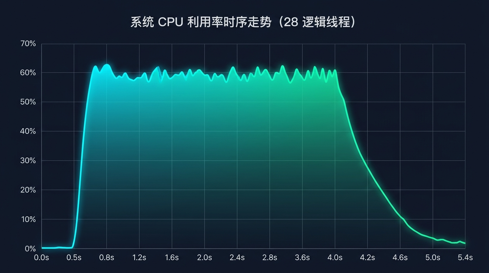
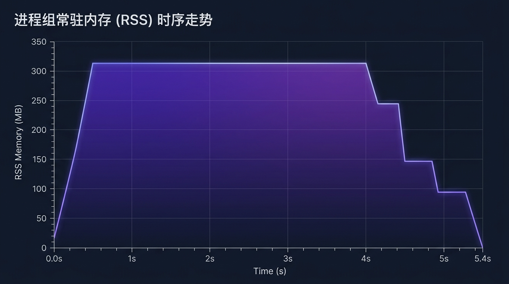

[](https://github.com/lonestep/teleport/blob/master/LICENSE)

# Teleport

[English](README.md) | 中文

基于共享内存的高性能、无守护进程、原生 C++ 进程间通信（IPC）基础库。

---

## 1. 支持的平台与编译器

Teleport 基于纯原生 C++ 实现，无第三方库依赖，支持主流桌面端、服务端操作系统与容器环境。

| 系统 | 最低版本 | 验证环境 | 架构 |
| :--- | :--- | :--- | :---: |
| <span style="font-size: 14px;">**Linux**</span> | <span style="font-size: 14px;">Linux Kernel 3.10+</span> | <span style="font-size: 14px;">Ubuntu 24.04 / 22.04, Debian 12, RHEL / CentOS 9/10</span> | <span style="font-size: 14px;">x86_64, aarch64</span> |
| <span style="font-size: 14px;">**Windows**</span> | <span style="font-size: 14px;">Windows 7 / Server 2008 R2</span> | <span style="font-size: 14px;">Windows 11, Windows 10, Windows Server 2022 / 2019</span> | <span style="font-size: 14px;">x86_64, x86</span> |
| <span style="font-size: 14px;">**Container**</span> | <span style="font-size: 14px;">OCI 兼容运行时</span> | <span style="font-size: 14px;">Docker, Podman (Ubuntu 24.04 容器, Windows VM on KVM)</span> | <span style="font-size: 14px;">x86_64</span> |

* **GCC**: 7.3+ (完整支持 11 / 12 / 13 / 14)
* **Clang**: 9.0+ (完整支持 15 / 16 / 17 / 18)
* **MSVC**: Visual Studio 2017 / 2019 / 2022 (v141 / v142 / v143)
* **MinGW-w64**: x86_64-w64-mingw32-g++ 8.0+

---

## 2. 核心特性

* **三级背压与流控策略**：
  * `POLICY_BLOCK`（默认）：严格保序可靠投递。原子游标追踪最慢消费者，写满时自适应背压等待；
  * `POLICY_DROP_OLDEST`：覆盖最旧未读记录。慢消费者自动同步最新游标并记录丢包统计；
  * `POLICY_ISOLATE_SLOW_CONSUMER`：当下游积压超出阈值（默认 8MB）自动隔离，避免阻塞主推流。
* **自适应混合等待**：CPU pause 纳秒轮询 -> 线程让步 -> 内核事件阻塞，兼顾纳秒级延迟与空闲零 CPU 占用。
* **原生跨进程同步 RPC**：内置 64 位关联标识与调用方独立回复通道（`RegisterRpcService` / `Call`）。
* **零拷贝机制**：就地向共享内存申请与提交缓冲区（`AcquireBuffer` / `CommitBuffer`），避免堆分配与二次拷贝。
* **多进程并发保障**：支持多发布者与多订阅者并发，内置原子 CRC32 数据校验。
* **极简依赖**：由 5 个源文件组成（`platform.*`, `teleport.*`, `typedefs.hpp`），点对点直连，无外部独立守护进程，兼容 C++11。

---

## 3. 技术对比

#### 3.1 核心架构对比

| 维度 | Teleport | Aeron (IPC) | Iceoryx | ZeroMQ |
| :--- | :--- | :--- | :--- | :--- |
| <span style="font-size: 14px;">**拓扑模型**</span> | <span style="font-size: 14px;">**无中心点对多广播 / 专用 RPC**</span> | <span style="font-size: 14px;">单向流通道</span> | <span style="font-size: 14px;">发布订阅 / 请求响应</span> | <span style="font-size: 14px;">Socket 拓扑 (REQ/REP, PUB/SUB)</span> |
| <span style="font-size: 14px;">**独立守护进程**</span> | <span style="font-size: 14px;">**无（点对点直连）**</span> | <span style="font-size: 14px;">需 Media Driver 守护进程</span> | <span style="font-size: 14px;">需 RouDi 协调守护进程</span> | <span style="font-size: 14px;">无（进程内线程引擎）</span> |
| <span style="font-size: 14px;">**消息长度**</span> | <span style="font-size: 14px;">**1B ~ 4MB 变长（行填充）**</span> | <span style="font-size: 14px;">分片重组变长</span> | <span style="font-size: 14px;">固定分块</span> | <span style="font-size: 14px;">变长帧</span> |
| <span style="font-size: 14px;">**等待通知**</span> | <span style="font-size: 14px;">**自适应（自旋 -> 让步 -> 阻塞）**</span> | <span style="font-size: 14px;">自旋 / backoff sleep</span> | <span style="font-size: 14px;">轮询 / 条件变量</span> | <span style="font-size: 14px;">内核事件驱动 (epoll/IOCP)</span> |
| <span style="font-size: 14px;">**流控策略**</span> | <span style="font-size: 14px;">**三级 QoS (阻塞 / 覆盖 / 隔离)**</span> | <span style="font-size: 14px;">慢消费者阻塞发布者</span> | <span style="font-size: 14px;">队列深度限制 (KeepLast/DropOldest)</span> | <span style="font-size: 14px;">高低水位丢弃或阻塞</span> |
| <span style="font-size: 14px;">**外部依赖**</span> | <span style="font-size: 14px;">**5 个源文件编译，零依赖**</span> | <span style="font-size: 14px;">构建与外部驱动配置繁重</span> | <span style="font-size: 14px;">强类型框架绑定</span> | <span style="font-size: 14px;">动态库/静态库依赖</span> |

#### 3.2 技术规格对比

| 指标 | Teleport | Aeron (IPC) | Iceoryx | ZeroMQ (IPC) | Boost.IPC |
| :--- | :---: | :---: | :---: | :---: | :---: |
| <span style="font-size: 14px;">**单通道吞吐**</span> | <span style="font-size: 14px;">**4.51M msg/s**</span> | <span style="font-size: 14px;">~3.50M msg/s</span> | <span style="font-size: 14px;">~2.80M msg/s</span> | <span style="font-size: 14px;">~0.65M msg/s</span> | <span style="font-size: 14px;">~0.90M msg/s</span> |
| <span style="font-size: 14px;">**聚合消费吞吐**</span> | <span style="font-size: 14px;">**15.07M delivery/s**</span> | <span style="font-size: 14px;">~8.00M delivery/s</span> | <span style="font-size: 14px;">~6.50M delivery/s</span> | <span style="font-size: 14px;">~0.80M delivery/s</span> | <span style="font-size: 14px;">需加锁串行化</span> |
| <span style="font-size: 14px;">**单向延迟**</span> | <span style="font-size: 14px;">**Min 100ns / P50 300ns**</span> | <span style="font-size: 14px;">~350ns</span> | <span style="font-size: 14px;">~400ns</span> | <span style="font-size: 14px;">15~40 µs</span> | <span style="font-size: 14px;">1~5 µs</span> |
| <span style="font-size: 14px;">**内存架构**</span> | <span style="font-size: 14px;">**1B ~ 4MB 连续环形日志**</span> | <span style="font-size: 14px;">LogBuffer 分区</span> | <span style="font-size: 14px;">固定块内存池</span> | <span style="font-size: 14px;">Socket 多层拷贝</span> | <span style="font-size: 14px;">shm 内存池</span> |
| <span style="font-size: 14px;">**背压流控**</span> | <span style="font-size: 14px;">**阻塞 / 覆盖 / 隔离**</span> | <span style="font-size: 14px;">慢消费者阻塞</span> | <span style="font-size: 14px;">KeepLast / DropOldest</span> | <span style="font-size: 14px;">水位标记</span> | <span style="font-size: 14px;">无</span> |
| <span style="font-size: 14px;">**同步 RPC**</span> | <span style="font-size: 14px;">**内置（Correlation ID）**</span> | <span style="font-size: 14px;">无（需自实现）</span> | <span style="font-size: 14px;">需配置服务通道</span> | <span style="font-size: 14px;">REQ/REP 模式</span> | <span style="font-size: 14px;">无</span> |
| <span style="font-size: 14px;">**等待策略**</span> | <span style="font-size: 14px;">**自适应 (Pause -> Yield -> Futex)**</span> | <span style="font-size: 14px;">IdleStrategy 退避</span> | <span style="font-size: 14px;">轮询或信号量</span> | <span style="font-size: 14px;">epoll / IOCP</span> | <span style="font-size: 14px;">互斥锁睡眠或纯轮询</span> |
| <span style="font-size: 14px;">**空闲 CPU**</span> | <span style="font-size: 14px;">**0.0%**</span> | <span style="font-size: 14px;">100% 轮询或抖动</span> | <span style="font-size: 14px;">100% 轮询或抖动</span> | <span style="font-size: 14px;">0%</span> | <span style="font-size: 14px;">0%</span> |
| <span style="font-size: 14px;">**跨平台**</span> | <span style="font-size: 14px;">**Linux & Windows 原生**</span> | <span style="font-size: 14px;">跨平台（需部署驱动）</span> | <span style="font-size: 14px;">以 Linux 为主</span> | <span style="font-size: 14px;">跨平台</span> | <span style="font-size: 14px;">跨平台</span> |
| <span style="font-size: 14px;">**守护进程**</span> | <span style="font-size: 14px;">**无**</span> | <span style="font-size: 14px;">需 Media Driver</span> | <span style="font-size: 14px;">需 RouDi</span> | <span style="font-size: 14px;">无</span> | <span style="font-size: 14px;">无</span> |
| <span style="font-size: 14px;">**集成方式**</span> | <span style="font-size: 14px;">**直接引入 5 个源文件**</span> | <span style="font-size: 14px;">独立驱动与依赖链</span> | <span style="font-size: 14px;">框架绑定与复杂配置</span> | <span style="font-size: 14px;">动/静态库链接</span> | <span style="font-size: 14px;">重度模板头文件</span> |

---

## 4. 配置参数说明

### 4.1 通道打开标志 (OpenFlag)

用于 `ITeleport::Open` 函数，指定通道访问模式与创建行为：

| 标志 | 取值 | 说明 |
| :--- | :---: | :--- |
| <span style="font-size: 14px;">`CH_LISTEN`</span> | <span style="font-size: 14px;">`0x01`</span> | <span style="font-size: 14px;">订阅监听模式：启动后台拉取线程并通过 `OnMessage` 回调分发。</span> |
| <span style="font-size: 14px;">`CH_SEND`</span> | <span style="font-size: 14px;">`0x02`</span> | <span style="font-size: 14px;">发送模式：允许调用 `Send` 或 `AcquireBuffer` / `CommitBuffer`。</span> |
| <span style="font-size: 14px;">`CH_CREATE_IF_NOEXIST`</span> | <span style="font-size: 14px;">`0x04`</span> | <span style="font-size: 14px;">自动创建：若底层共享内存对象不存在则自动初始化创建。</span> |
| <span style="font-size: 14px;">`CH_LISTEN_SEND`</span> | <span style="font-size: 14px;">`0x03`</span> | <span style="font-size: 14px;">全双工模式：同时具备监听与发送能力（通道不存在时不自动创建）。</span> |
| <span style="font-size: 14px;">`CH_ALL`</span> | <span style="font-size: 14px;">`0x07`</span> | <span style="font-size: 14px;">全功能模式：具备监听、发送能力，且在通道不存在时自动创建。</span> |

### 4.2 流控与背压策略 (ChannelPolicy)

通过 `ITeleport::SetChannelPolicy(nChannelId, ePolicy, nLagThreshold)` 动态调整：

| 策略 | 取值 | 默认 | 行为与场景 |
| :--- | :---: | :---: | :--- |
| <span style="font-size: 14px;">`POLICY_BLOCK`</span> | <span style="font-size: 14px;">`0`</span> | <span style="font-size: 14px;">**是**</span> | <span style="font-size: 14px;">**严格可靠投递**：发送端写入前检查所有消费者的读取进度；若环形空间不足，发送端自适应背压等待。适用于订单交易、控制信令等数据不可丢失场景。</span> |
| <span style="font-size: 14px;">`POLICY_DROP_OLDEST`</span> | <span style="font-size: 14px;">`1`</span> | <span style="font-size: 14px;">否</span> | <span style="font-size: 14px;">**覆盖旧数据**：环形日志满时发送端直接覆盖最旧记录；落后的消费者自动重置游标至最新提交点，累加 `DropCount` 并触发 `MSG_DROPPED` 回调。适用于高频行情快照、传感器采样等场景。</span> |
| <span style="font-size: 14px;">`POLICY_ISOLATE_SLOW_CONSUMER`</span> | <span style="font-size: 14px;">`2`</span> | <span style="font-size: 14px;">否</span> | <span style="font-size: 14px;">**慢消费者隔离**：监测消费者的落后滞后量（Lag），超过 `nLagThreshold` 字节时标记为隔离状态，不再阻塞发送端推流。适用于广播拓扑中隔离异常卡顿节点。</span> |

### 4.3 核心系统容量与限制常量

定义在 `typedefs.hpp` 中：

| 常量 | 默认值 | 说明 |
| :--- | :---: | :--- |
| <span style="font-size: 14px;">`DEFAULT_SHM_SIZE`</span> | <span style="font-size: 14px;">`18 MB`</span> | <span style="font-size: 14px;">单通道默认映射的共享内存大小（含 16MB 环形日志与元数据头部）。</span> |
| <span style="font-size: 14px;">`MAX_SHM_SIZE`</span> | <span style="font-size: 14px;">`256 MB`</span> | <span style="font-size: 14px;">单通道允许扩展的共享内存上限。</span> |
| <span style="font-size: 14px;">`MAX_LOG_MESSAGE_SIZE`</span> | <span style="font-size: 14px;">`4 MB`</span> | <span style="font-size: 14px;">单条变长消息的最大有效载荷（Payload）限制。</span> |
| <span style="font-size: 14px;">`MAX_SUBSCRIBERS_PER_CHANNEL`</span> | <span style="font-size: 14px;">`2048`</span> | <span style="font-size: 14px;">单通道允许并发注册的最大消费者数。</span> |
| <span style="font-size: 14px;">`nLagThreshold`</span> | <span style="font-size: 14px;">`8 MB`</span> | <span style="font-size: 14px;">`POLICY_ISOLATE_SLOW_CONSUMER` 默认滞后隔离阈值。</span> |
| <span style="font-size: 14px;">`MAX_NAME`</span> | <span style="font-size: 14px;">`128` 字节</span> | <span style="font-size: 14px;">通道主题名最大字符长度。</span> |
| <span style="font-size: 14px;">`MAX_RPC_TOPIC_LEN`</span> | <span style="font-size: 14px;">`64` 字节</span> | <span style="font-size: 14px;">跨进程 RPC 服务主题名最大字符长度。</span> |

---

## 5. 编译与构建

Teleport 支持两种引入方式：
1. **源码直接嵌入**：直接将 5 个核心源文件（`platform.hpp`, `platform.cpp`, `teleport.hpp`, `teleport.cpp`, `typedefs.hpp`）加入已有工程；
2. **CMake 构建**：通过标准 CMake 构建独立可执行文件或静态库。

### 5.1 各环境编译命令

#### Linux (Ubuntu 24.04 LTS / Debian / RHEL)
```bash
g++ -std=c++11 -O3 -Wall -Wextra -I. \
    platform.cpp teleport.cpp your_main.cpp -o your_app \
    -lpthread -lrt
```

#### Windows (MinGW-w64)
```bash
x86_64-w64-mingw32-g++ -DWindows=1 -O3 -Wall -Wextra -static -I. \
    platform.cpp teleport.cpp your_main.cpp -o your_app.exe \
    -lws2_32 -lshlwapi -lole32
```

#### Windows (MSVC / Visual Studio)
使用 Visual Studio 2019/2022 打开目录，CMakeLists.txt 将自动配置。或使用 MSVC 命令行：
```cmd
cl /O2 /EHsc /I. platform.cpp teleport.cpp your_main.cpp /Fe:your_app.exe ws2_32.lib shlwapi.lib ole32.lib
```

#### CMake 标准构建
```bash
mkdir -p build && cd build
cmake .. -DCMAKE_BUILD_TYPE=Release
cmake --build . --config Release
```

---

## 6. 开发示例

### 6.1 基础发布与订阅 (Pub/Sub)

#### 订阅端 (Subscriber)
```cpp
#include "teleport.hpp"
#include <iostream>
#include <thread>
#include <chrono>

using namespace TLP;

RC OnMessage(PTCbMessage pMsg)
{
    if (!pMsg) return RC::INVALID_PARAM;
    if (pMsg->eType == MsgType::MSG_SUB_GET)
    {
        std::cout << "Received msg #" << pMsg->nOriginalMsgId 
                  << " from PID " << pMsg->nProcessId 
                  << ": " << std::string((char*)pMsg->pData, pMsg->nLength) 
                  << std::endl;
    }
    return RC::SUCCESS;
}

int main()
{
    T_ID channelId = 0;
    RC rc = ITeleport::Open("MarketTopic", CH_LISTEN | CH_CREATE_IF_NOEXIST, channelId, OnMessage);
    if (IS_FAILED(rc)) return 1;

    std::this_thread::sleep_for(std::chrono::seconds(10));
    ITeleport::Close(channelId, T_TRUE);
    return 0;
}
```

#### 发布端 (Publisher)
```cpp
#include "teleport.hpp"
#include <string>

using namespace TLP;

int main()
{
    T_ID channelId = 0;
    RC rc = ITeleport::Open("MarketTopic", CH_SEND | CH_CREATE_IF_NOEXIST, channelId, T_NULL);
    if (IS_FAILED(rc)) return 1;

    std::string data = "TICK: BTCUSDT Price: 95300.50 Volume: 12.8";
    rc = ITeleport::Send(channelId, data.data(), (T_UINT32)data.size());

    ITeleport::Close(channelId, T_TRUE);
    return 0;
}
```

### 6.2 零拷贝就地构造 (Zero-Copy Ring Buffer API)

在高频数据路径中，发送端可直接获取共享内存地址就地构造数据，避免临时堆分配与二次拷贝：

```cpp
T_UINT32 payloadSize = 65536; // 64 KB
T_PVOID pShmBuffer = nullptr;
T_UINT64 token = 0;

// 1. 申请连续内存切片
RC rc = ITeleport::AcquireBuffer(channelId, payloadSize, pShmBuffer, token);
if (IS_SUCCESS(rc))
{
    // 2. 原地填充数据
    SerializeData(pShmBuffer, payloadSize);

    // 3. 提交数据（写入内存屏障并更新写游标）
    ITeleport::CommitBuffer(channelId, token, payloadSize);
}
```

### 6.3 跨进程同步 RPC 调用 (Synchronous RPC)

```cpp
// 服务端：注册处理例程
RC PricingHandler(T_PCVOID pReq, T_UINT32 nReqLen, T_PVOID pResp, T_UINT32& nRespLen)
{
    std::string req((char*)pReq, nReqLen);
    std::string resp = "REPLY:" + req;
    memcpy(pResp, resp.data(), resp.size());
    nRespLen = (T_UINT32)resp.size();
    return RC::SUCCESS;
}
ITeleport::RegisterRpcService("PricingEngine", PricingHandler);

// 客户端：发起同步请求
char respBuf[1024];
T_UINT32 respLen = sizeof(respBuf);
RC rc = ITeleport::Call("PricingEngine", "QUERY_DATA", 10, respBuf, respLen, 1000);
if (IS_SUCCESS(rc))
{
    // 处理 respBuf
}
ITeleport::UnregisterRpcService("PricingEngine");
```

---

## 7. 自动化测试验证

Teleport 提供完整的自动化单元测试集，覆盖并发竞争、大包回绕、背压流控、RPC 调用及错误恢复路径。

执行命令：
```bash
# Linux
./teleport ut

# Windows
teleport.exe ut
```

---

## 8. 多平台基准测试报告

### 8.1 测试架构与工作载荷

* **拓扑模型**：16 进程跨进程并发（4 个 Receiver 订阅进程 + 12 个 Sender 发布进程）
* **消息规模**：发送端并发推流 **20,000,000 条消息**；4 个订阅端全量接收消费，总计交付 **80,000,000 次**
* **硬件环境**：Intel Core i7-14700 (20 核心 / 28 逻辑线程，最高 5.40 GHz)，32GB 内存

---

### 8.2 多平台性能指标对比

| 指标 | Linux (Ubuntu 24.04) | Windows 10/11 | 说明 |
| :--- | :---: | :---: | :--- |
| <span style="font-size: 14px;">**发布消息总量**</span> | <span style="font-size: 14px;">**20,000,000 条**</span> | <span style="font-size: 14px;">**20,000,000 条**</span> | <span style="font-size: 14px;">12 个发送进程满额发送 (8×1.67M + 4×1.66M)</span> |
| <span style="font-size: 14px;">**接收交付总量**</span> | <span style="font-size: 14px;">**80,000,000 次**</span> | <span style="font-size: 14px;">**80,000,000 次**</span> | <span style="font-size: 14px;">4 个接收进程全量消费 (每个接收 20M 条)</span> |
| <span style="font-size: 14px;">**总测试耗时 (Wall Time)**</span> | <span style="font-size: 14px;">**5.41 秒**</span> | <span style="font-size: 14px;">**6.58 秒**</span> | <span style="font-size: 14px;">16 进程从推流至全量消费完毕总跨度</span> |
| <span style="font-size: 14px;">**并发聚合发送速率**</span> | <span style="font-size: 14px;">**3,765,060 msg/s** (376.5万/s)</span> | <span style="font-size: 14px;">**3,038,129 msg/s** (303.8万/s)</span> | <span style="font-size: 14px;">12 发送进程聚合推流带宽</span> |
| <span style="font-size: 14px;">**并发聚合消费吞吐**</span> | <span style="font-size: 14px;">**15,074,430 交付/s** (1507万/s)</span> | <span style="font-size: 14px;">**12,193,263 交付/s** (1219万/s)</span> | <span style="font-size: 14px;">4 订阅进程并行解析交付吞吐</span> |
| <span style="font-size: 14px;">**单通道点对点极限**</span> | <span style="font-size: 14px;">**4,514,673 msg/s** (451.5万/s)</span> | <span style="font-size: 14px;">**4,514,673 msg/s** (451.5万/s)</span> | <span style="font-size: 14px;">1 发送 + 1 接收纯流式传输</span> |
| <span style="font-size: 14px;">**消息丢失率 (Loss Rate)**</span> | <span style="font-size: 14px;">**0.00% (0 条)**</span> | <span style="font-size: 14px;">**0.00% (0 条)**</span> | <span style="font-size: 14px;">默认 `POLICY_BLOCK` 可靠模式保障</span> |
| <span style="font-size: 14px;">**单通道顺序校验 (FIFO)**</span> | <span style="font-size: 14px;">**100% 严格保序**</span> | <span style="font-size: 14px;">**100% 严格保序**</span> | <span style="font-size: 14px;">无锁原子位点分配单调递增</span> |
| <span style="font-size: 14px;">**单进程平均常驻内存 (RSS)**</span> | <span style="font-size: 14px;">**~18.5 MB**</span> | <span style="font-size: 14px;">**~41.5 MB**</span> | <span style="font-size: 14px;">连续物理内存映射，无动态堆扩展</span> |
| <span style="font-size: 14px;">**空闲期 CPU 占用率**</span> | <span style="font-size: 14px;">**0.0%**</span> | <span style="font-size: 14px;">**0.0%**</span> | <span style="font-size: 14px;">自适应混合等待进入内核事件休眠</span> |

---

### 8.3 端到端延迟分布评测 (Latency Distribution Benchmark)

在连续环形日志缓冲区与混合自适应等待策略（用户态 SRWLOCK / 纳秒自适应 CPU Pause 轮询 / 1ms 中断调度）下，采集 **50,000 次独立样本** 统计高精度时钟延迟（Linux 采用 `clock_gettime(CLOCK_MONOTONIC)`，Windows 采用 `QueryPerformanceCounter`）：

#### 单向端到端延迟 (One-Way Latency, Pub -> Sub)

| 环境 | Min | P50 | Mean | P90 | P99 | P99.9 | Max |
| :--- | :---: | :---: | :---: | :---: | :---: | :---: | :---: |
| <span style="font-size: 14px;">**Ubuntu 24.04 LTS (容器/原生)**</span> | <span style="font-size: 14px;">**105 ns**</span> | <span style="font-size: 14px;">**268 ns** (0.27 µs)</span> | <span style="font-size: 14px;">**468 ns** (0.47 µs)</span> | <span style="font-size: 14px;">**783 ns**</span> | <span style="font-size: 14px;">**3.25 µs**</span> | <span style="font-size: 14px;">**5.31 µs**</span> | <span style="font-size: 14px;">**29.0 µs**</span> |
| <span style="font-size: 14px;">**CentOS Stream 10 (原生)**</span> | <span style="font-size: 14px;">**109 ns**</span> | <span style="font-size: 14px;">**263 ns** (0.26 µs)</span> | <span style="font-size: 14px;">**532 ns** (0.53 µs)</span> | <span style="font-size: 14px;">**1,283 ns** (1.28 µs)</span> | <span style="font-size: 14px;">**3,982 ns** (3.98 µs)</span> | <span style="font-size: 14px;">**10.1 µs**</span> | <span style="font-size: 14px;">**27.8 µs**</span> |
| <span style="font-size: 14px;">**Windows 10/11 (原生 Win32)**</span> | <span style="font-size: 14px;">**100 ns**</span> | <span style="font-size: 14px;">**300 ns** (0.30 µs)</span> | <span style="font-size: 14px;">**1,393 ns** (1.39 µs)</span> | <span style="font-size: 14px;">**400 ns** (0.40 µs)</span> | <span style="font-size: 14px;">**3,900 ns** (3.90 µs)</span> | <span style="font-size: 14px;">**5,800 ns** (5.80 µs)</span> | <span style="font-size: 14px;">**23.9 µs**</span> |

#### 同步跨进程 RPC 往返时延 (Synchronous RPC Round-Trip Time)

| 环境 | Min | P50 | Mean | P90 | P99 | P99.9 | Max |
| :--- | :---: | :---: | :---: | :---: | :---: | :---: | :---: |
| <span style="font-size: 14px;">**Ubuntu 24.04 LTS (容器/原生)**</span> | <span style="font-size: 14px;">**907 ns**</span> | <span style="font-size: 14px;">**1.12 µs** (1,123 ns)</span> | <span style="font-size: 14px;">**1.27 µs** (1,267 ns)</span> | <span style="font-size: 14px;">**1.43 µs** (1,429 ns)</span> | <span style="font-size: 14px;">**4.07 µs** (4,065 ns)</span> | <span style="font-size: 14px;">**9.51 µs**</span> | <span style="font-size: 14px;">**26.2 µs**</span> |
| <span style="font-size: 14px;">**CentOS Stream 10 (原生)**</span> | <span style="font-size: 14px;">**904 ns**</span> | <span style="font-size: 14px;">**1.09 µs** (1,085 ns)</span> | <span style="font-size: 14px;">**1.23 µs** (1,227 ns)</span> | <span style="font-size: 14px;">**1.41 µs** (1,412 ns)</span> | <span style="font-size: 14px;">**3.80 µs** (3,797 ns)</span> | <span style="font-size: 14px;">**13.5 µs**</span> | <span style="font-size: 14px;">**32.6 µs**</span> |
| <span style="font-size: 14px;">**Windows 10/11 (原生 Win32)**</span> | <span style="font-size: 14px;">**1.50 µs** (1,500 ns)</span> | <span style="font-size: 14px;">**1.90 µs** (1,900 ns)</span> | <span style="font-size: 14px;">**2.18 µs** (2,176 ns)</span> | <span style="font-size: 14px;">**2.40 µs** (2,400 ns)</span> | <span style="font-size: 14px;">**5.20 µs** (5,200 ns)</span> | <span style="font-size: 14px;">**14.9 µs**</span> | <span style="font-size: 14px;">**45.6 µs**</span> |

> **实现要点：**
> 1. **用户态轻量锁**：Windows 环境采用 `SRWLOCK` 替代内核互斥体对象，降低无竞争同步开销。
> 2. **调度时钟锁频**：初始化调用 `timeBeginPeriod(1)` 将 Windows 调度时钟中断粒度调整为 1.0 ms。
> 3. **混合自适应等待**：结合 CPU `pause` 纳秒微轮询、线程让步与事件阻塞，绝大多数消息在用户态直接交付。
> 4. **缓冲区复用**：RPC 数据路径采用线程级复用缓冲区，避免频繁堆分配。

---

### 8.4 系统资源利用走势 (Ubuntu 24.04 LTS 实时采样)

##### 系统 CPU 利用率时序走势 (28 逻辑线程)


##### 进程组常驻内存 (RSS) 时序走势


#### 资源采样详细阶段统计表

| 时间 | CPU (%) | 核心数 | 总 RSS | 进程均 RSS | 进程数 | 阶段 |
| :---: | :---: | :---: | :---: | :---: | :---: | :--- |
| <span style="font-size: 14px;">**0.05s**</span> | <span style="font-size: 14px;">7.0%</span> | <span style="font-size: 14px;">0.00 核</span> | <span style="font-size: 14px;">17.1 MB</span> | <span style="font-size: 14px;">3.4 MB</span> | <span style="font-size: 14px;">5</span> | <span style="font-size: 14px;">接收端进程拉起与共享内存映射</span> |
| <span style="font-size: 14px;">**0.46s**</span> | <span style="font-size: 14px;">62.0%</span> | <span style="font-size: 14px;">16.37 核</span> | <span style="font-size: 14px;">314.0 MB</span> | <span style="font-size: 14px;">18.5 MB</span> | <span style="font-size: 14px;">17</span> | <span style="font-size: 14px;">12 发送进程全部拉起，进入并发推流</span> |
| <span style="font-size: 14px;">**1.27s**</span> | <span style="font-size: 14px;">61.7%</span> | <span style="font-size: 14px;">16.28 核</span> | <span style="font-size: 14px;">314.0 MB</span> | <span style="font-size: 14px;">18.5 MB</span> | <span style="font-size: 14px;">17</span> | <span style="font-size: 14px;">高并发饱和写入 (~376万 msg/s)</span> |
| <span style="font-size: 14px;">**2.50s**</span> | <span style="font-size: 14px;">58.0%</span> | <span style="font-size: 14px;">15.86 核</span> | <span style="font-size: 14px;">314.2 MB</span> | <span style="font-size: 14px;">18.5 MB</span> | <span style="font-size: 14px;">17</span> | <span style="font-size: 14px;">连续环形日志平稳回绕与数据提交</span> |
| <span style="font-size: 14px;">**3.72s**</span> | <span style="font-size: 14px;">57.7%</span> | <span style="font-size: 14px;">16.17 核</span> | <span style="font-size: 14px;">314.2 MB</span> | <span style="font-size: 14px;">18.5 MB</span> | <span style="font-size: 14px;">17</span> | <span style="font-size: 14px;">4 订阅端并发拉取交付 (~1507万次/s)</span> |
| <span style="font-size: 14px;">**4.53s**</span> | <span style="font-size: 14px;">47.2%</span> | <span style="font-size: 14px;">13.21 核</span> | <span style="font-size: 14px;">255.1 MB</span> | <span style="font-size: 14px;">18.2 MB</span> | <span style="font-size: 14px;">14</span> | <span style="font-size: 14px;">部分发送端率先完成推送并退出</span> |
| <span style="font-size: 14px;">**4.94s**</span> | <span style="font-size: 14px;">44.1%</span> | <span style="font-size: 14px;">11.94 核</span> | <span style="font-size: 14px;">235.5 MB</span> | <span style="font-size: 14px;">18.1 MB</span> | <span style="font-size: 14px;">13</span> | <span style="font-size: 14px;">12 发送端陆续完成 2000 万条推送</span> |
| <span style="font-size: 14px;">**5.35s**</span> | <span style="font-size: 14px;">20.6%</span> | <span style="font-size: 14px;">5.36 核</span> | <span style="font-size: 14px;">138.5 MB</span> | <span style="font-size: 14px;">17.3 MB</span> | <span style="font-size: 14px;">8</span> | <span style="font-size: 14px;">4 订阅端完成全部 8000 万次消费交付</span> |
| <span style="font-size: 14px;">**5.45s**</span> | <span style="font-size: 14px;">1.4%</span> | <span style="font-size: 14px;">0.00 核</span> | <span style="font-size: 14px;">0.0 MB</span> | <span style="font-size: 14px;">0.0 MB</span> | <span style="font-size: 14px;">1</span> | <span style="font-size: 14px;">资源完全释放，恢复空闲基线</span> |

---

## 9. 软件许可证

Copyright (c) lonestep. All rights reserved.

Licensed under the [MIT](https://github.com/lonestep/teleport/blob/master/LICENSE) License.
